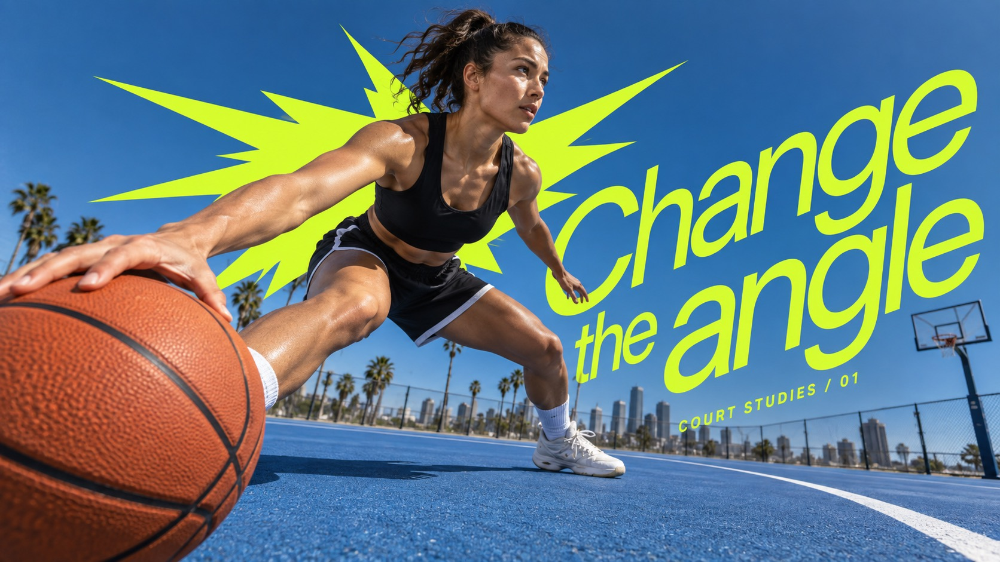

# Acid Burst Motion Type



Extreme wide-angle action photography with an enlarged near-lens object, saturated blue environmental depth, one acid-colored angular burst behind the subject and oversized lean typography sweeping diagonally through the foreground.

## Copy Prompt

Default case: `court-rebound`

```text
Use the "Acid Burst Motion Type" visual style as the locked style.

Create a 16:9 image.

Subject: An adult female basketball player making a forceful low crossover dribble on an outdoor blue court. Camera a few inches above the floor beside the near orange basketball, which looms in foreground but remains below her connected open hand; she lunges sideways with both feet on court, torso receding toward deep blue sky. Plain black and white sportswear, no logos.
Action: [your explosive mid-motion athletic movement caught at its peak instant]
Prop / product: [your the enlarged sports object sitting closest to the wide-angle lens]
Location: [your a saturated blue sports environment receding steeply behind the subject]
Background: [your deep environmental perspective, motion streaks and the angular acid-colored burst shape]
Main text: Change the angle
Secondary text: [your compact supporting labels set against the oversized headline]
Accent symbol: [your the angular acid-colored burst wedge behind the subject]
Styling: [your athletic kit matched to the sport, in colors that hold against the acid accent]

Style direction:
Extreme wide-angle action photography with an enlarged near-lens object, saturated blue
environmental depth, one acid-colored angular burst behind the subject and oversized lean
typography sweeping diagonally through the foreground.

Keep visible:
- [CORE] A believable dynamic wide-angle photograph with dramatic near/far scale: one relevant object or limb enters near the lens while the connected adult subject recedes; saturated blue sky or environmental field creates deep contrast.
- [CORE] One flat hard-edged asymmetric jagged burst in a vivid acid ink sits behind the main subject, with real photographic silhouette occluding it. It is a graphic plane, not a glow, splash or many small decorative stars.
- [CORE] Huge lean regular-weight geometric/neo-grotesk lettering in the same acid ink sweeps on an oblique diagonal through foreground space. Use open counters, tight expressive line relationships and readable words; no bold block, handwritten lettering or colored text boxes.
- [FLEX] Burst contour and long spikes answer the action's force or direction; source crown-like spike count and exact placement are not mandatory.
- [FLEX] Choose foreground object, pose, camera, environment and crop according to the theme; do not repeat a rear-view runner and shoe sole.

Avoid:
No original slogan or brands, no watermark, no creator signature, no thick block typography, no
text boxes, no comic ink outlines, no duplicated body, no arbitrary floating objects.

Do not copy source content, real logos, watermarks, platform UI, QR codes, or exact
reference layouts. Keep the visual system, but change the subject, text, and scene.
```

## Full Style

- [Open style.json](../../styles/acid-burst-motion-type/style.json)
- [Open style folder](../../styles/acid-burst-motion-type/)

<!-- Generated by scripts/generate-copy-prompts.py. Do not edit manually. -->
