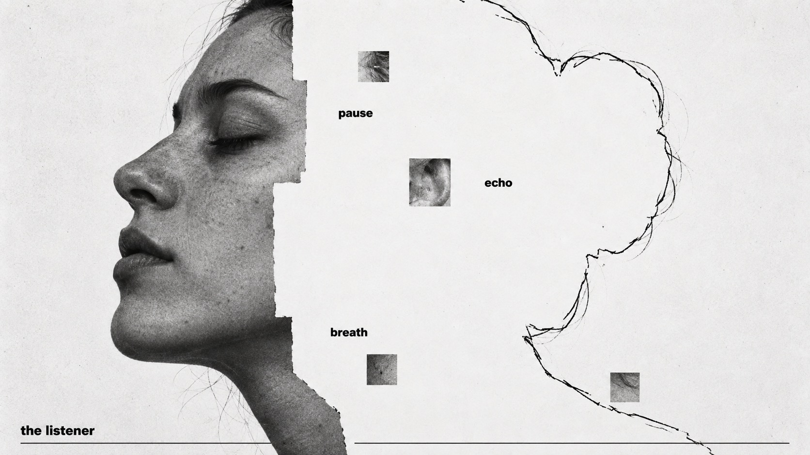

# Annotated Absence



A photographic subject yields to white paper, retained as hand-traced contour, intimate word labels and sparse gray image fragments.

## Copy Prompt

Default case: `the-listener`

```text
Use the "Annotated Absence" visual style as the locked style.

Create a 16:9 image.

Subject: Close-up side profile of an invented adult woman with a tight bun, visible ear, gently closed eye and calm mouth, facing left. No headphones or jewelry.
Action: [your How the photograph yields to contour and white paper]
Prop / product: [your Residual gray photographic squares and the tracing line]
Location: [your White paper field occupying the erased region]
Background: [your Empty paper, sparse gray fragments, optional thin edge rule]
Main text: the listener
Secondary text: [your Intimate lowercase feature labels in the absent region]
Accent symbol: [your Thin irregular black contour continuing the subject]
Styling: [your Clothing or hair remaining in the photographic remnant]

Style direction:
A photographic subject yields to white paper, retained as hand-traced contour, intimate word
labels and sparse gray image fragments.

Keep visible:
- [CORE] A single large grayscale photographic subject is partially removed by a decisive straight-edged white mask; the absent portion remains legible through a thin irregular black contour continuing the same subject.
- [CORE] The removed region is predominantly white paper, with a few small bold black lowercase word labels placed at meaningful absent features rather than in a separate legend.
- [CORE] Sparse grayscale square fragments preserve photographic texture as isolated residual pixels inside the erased region; never a full tiled collage.
- [CORE] Restrained black, white and gray only; intimate grainy documentary photograph contrasted with flat empty paper and rough hand-traced contour.
- [FLEX] Let the subject determine the mask axis, asymmetric balance, annotation positions and empty-space rhythm; maintain clear continuity between photograph and contour.

Avoid:
No color, gradients on the paper, extra words, fake credits, logos, watermarks, arrows,
measurement lines, grids, dense hatching, glossy renders, torn-paper effects, unrelated
photographic tiles, extra fingers or limbs.

Do not copy source content, real logos, watermarks, platform UI, QR codes, or exact
reference layouts. Keep the visual system, but change the subject, text, and scene.
```

## Full Style

- [Open style.json](../../styles/annotated-absence/style.json)
- [Open style folder](../../styles/annotated-absence/)

<!-- Generated by scripts/generate-copy-prompts.py. Do not edit manually. -->
