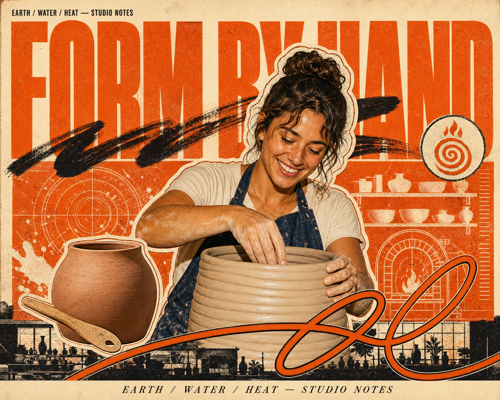

# Burnt Orange Halftone Hero Collage



A dense celebratory editorial poster system that combines one warm, flash-lit photographic hero cutout with burnt-orange screenprint panels, monumental condensed headline type, coarse halftone diagrams, dry-brush lettering, a looping foreground flourish, a monochrome base strip, and disciplined magazine microtype on aged cream paper.

## Copy Prompt

Default case: `kiln-notes`

```text
Use the "Burnt Orange Halftone Hero Collage" visual style as the locked style.

Create a 16:9 image.

Subject: an anonymous fictional ceramic artist in a warm waist-up portrait
Action: smiling while shaping the rim of a large coil-built vessel
Prop / product: a matte terracotta vessel without handles and one wooden modeling tool
Location: a sunlit community pottery studio abstracted as printed collage layers
Background: concentric wheel rings, shelf silhouettes, clay-splash marks, measurement ticks, and simplified kiln diagrams
Main text: FORM BY HAND
Secondary text: EARTH / WATER / HEAT — STUDIO NOTES
Accent symbol: an original spiral-and-flame seal
Styling: an indigo work apron over a cream short-sleeve shirt, lightly clay-marked and completely logo-free

Style direction:
A dense celebratory editorial poster system that combines one warm, flash-lit photographic hero
cutout with burnt-orange screenprint panels, monumental condensed headline type, coarse halftone
diagrams, dry-brush lettering, a looping foreground flourish, a monochrome base strip, and
disciplined magazine microtype on aged cream paper.

Keep visible:
- Warm uncoated cream paper ground with a restricted burnt-tangerine, near-black, cream, and white graphic palette around a selectively colorful photographic subject.
- One enormous extra-heavy condensed uppercase headline spans almost the full width behind the subject and is partly hidden by the head and shoulders.
- One dominant waist-up or chest-up photographic hero cutout occupies roughly two-thirds of the canvas and sits near center with a slight right bias.
- The hero and major prop use irregular pasted-sticker edging: a broad cream contour plus a thin black or orange keyline.
- Dense shallow editorial layering follows a fixed stack of paper ground, giant type, orange diagram panel, hero cutout, brush lettering, prop, foreground flourish, monochrome base strip, and caption footer.

Avoid:
No Oscar Piastri, no identifiable racing driver, no motorsport, no racing suit, no cap, no
medal, no trophy, no Formula car, no racetrack, no source headline, no source biography, no
copied autograph, no number 81, no real logo, no sponsor patch, no brand mark, no watermark, no
username, no QR code, no platform mark, no invented sponsor label, no cinematic sports
advertising, no deep perspective, no bokeh, no lens flare, no volumetric light, no dramatic sky,
no glossy 3D render, no clean vector minimalism, no Swiss grid, no spacious layout, no smooth
gradient, no chrome, no neon rainbow palette, no anime, no comic-book painting, no airbrushed
portrait, no serif headline, no bubble type, no extruded type, no gibberish, no excessive copy,
no random dirt, no heavy glitch, no JPEG artifacts, no blurred face, no low-resolution output.

Do not copy source content, real logos, watermarks, platform UI, QR codes, or exact
reference layouts. Keep the visual system, but change the subject, text, and scene.
```

## Full Style

- [Open style.json](../../styles/burnt-orange-halftone-hero-collage/style.json)
- [Open style folder](../../styles/burnt-orange-halftone-hero-collage/)

<!-- Generated by scripts/generate-copy-prompts.py. Do not edit manually. -->
