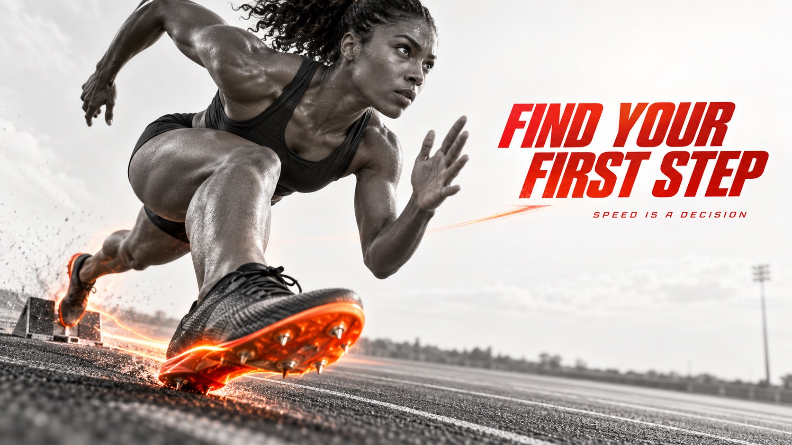

# Chromatic Impact Athlete



High-contrast athletic editorial posters that turn a frozen movement into a collision of grayscale body photography, extreme perspective, and a single red-orange energy accent.

## Copy Prompt

Default case: `launching-sprinter`

```text
Use the "Chromatic Impact Athlete" visual style as the locked style.

Create a 16:9 image.

Subject: a female track sprinter
Action: exploding out of the starting blocks, one knee driving toward the camera
Prop / product: a pair of streamlined racing spikes with a glowing orange sole plate
Location: [your Near-white negative space isolating the athlete]
Background: [your Clean poster ground, controlled warm glow and directional heat haze]
Main text: FIND YOUR FIRST STEP
Secondary text: SPEED IS A DECISION
Accent symbol: [your Single vermilion-to-orange impact zone or energy trail]
Styling: a minimal charcoal racing singlet and shorts

Style direction:
High-contrast athletic editorial posters that turn a frozen movement into a collision of
grayscale body photography, extreme perspective, and a single red-orange energy accent.

Keep visible:
- [CORE] High-contrast monochrome athletic photography or photoreal cutout with deep charcoal blacks, pale gray whites and crisp anatomical form.
- [CORE] A single vivid vermilion-to-orange accent is reserved for the featured object, impact zone or directional energy trail.
- [CORE] Extreme wide-angle or close-perspective cropping makes one body part or sport object dominate the frame and creates visceral depth.
- [CORE] Clean near-white negative space isolates the athlete and lets the action silhouette read immediately at poster scale.
- [CORE] Motion is expressed by controlled warm glow, directional blur or heat haze attached to the action, never by random decorative clutter.

Avoid:
No Nike swoosh, no copied brand logo, no exact reference slogan, no watermark, no QR code, no
app UI, no busy background, no rainbow palette, no cartoon rendering, no plastic 3D mannequin,
no illegible gibberish text, no duplicated limbs, no broken hands, no impossible equipment, no
random flames, no excessive lens flare, no ornamental collage clutter.

Do not copy source content, real logos, watermarks, platform UI, QR codes, or exact
reference layouts. Keep the visual system, but change the subject, text, and scene.
```

## Full Style

- [Open style.json](../../styles/chromatic-impact-athlete/style.json)
- [Open style folder](../../styles/chromatic-impact-athlete/)

<!-- Generated by scripts/generate-copy-prompts.py. Do not edit manually. -->
