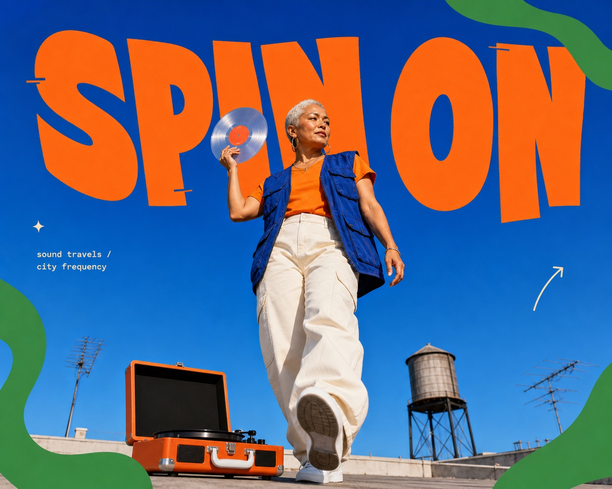

# Cobalt Pop Cutout Editorial



A high-saturation editorial poster system that combines one low-angle full-body photographic cutout with oversized irregular orange display lettering, a cobalt-to-sky-blue field, flat green organic edge shapes, and tiny cream callouts. The look is playful, spacious, and street-culture adjacent without becoming grungy or collage-dense.

## Copy Prompt

Default case: `record-route`

```text
Use the "Cobalt Pop Cutout Editorial" visual style as the locked style.

Create a 16:9 image.

Subject: a middle-aged woman DJ with close-cropped silver hair
Action: stepping forward while lifting a translucent vinyl record above one shoulder
Prop / product: a compact orange portable turntable case resting low in the foreground
Location: a sunlit rooftop listening party
Background: one distant water tower and two simple antenna silhouettes near the lower edge
Main text: SPIN ON
Secondary text: sound travels / city frequency
Accent symbol: a small rising arrow
Styling: a cobalt utility vest over an orange tee with wide cream trousers

Style direction:
A high-saturation editorial poster system that combines one low-angle full-body photographic
cutout with oversized irregular orange display lettering, a cobalt-to-sky-blue field, flat green
organic edge shapes, and tiny cream callouts. The look is playful, spacious, and street-culture
adjacent without becoming grungy or collage-dense.

Keep visible:
- A saturated cobalt-to-sky-blue field fills nearly the entire frame, with only restrained environmental details allowed near the lower edge.
- One crisp full-body photographic cutout dominates the center at roughly 55 to 70 percent of the frame height.
- The camera sits below waist level with a mild wide-angle upward perspective that makes the subject and foreground anchor feel monumental.
- A single oversized warm-orange headline spans the upper third, using solid-fill, chunky, hand-warped display letters on an uneven baseline.
- The photographic subject overlaps and obscures part of the headline so type and portrait read as one layered composition.

Avoid:
fire hydrant, person seated on a pedestal, head resting on hand, copied source face, copied
source outfit, copied source text, identical layout, crowd, multiple subjects, dense collage,
torn paper, ransom typography, halftone, photocopy noise, heavy grain, grunge, spray paint,
paint splatter, extra rainbow hues, muted palette, painterly illustration, anime, plastic 3D
character, extreme fisheye anatomy, malformed hands, duplicate limbs, cinematic bokeh, interface
panels, product grid, pricing badges, watermark, username, logo, QR code, signature

Do not copy source content, real logos, watermarks, platform UI, QR codes, or exact
reference layouts. Keep the visual system, but change the subject, text, and scene.
```

## Full Style

- [Open style.json](../../styles/cobalt-pop-cutout-editorial/style.json)
- [Open style folder](../../styles/cobalt-pop-cutout-editorial/)

<!-- Generated by scripts/generate-copy-prompts.py. Do not edit manually. -->
