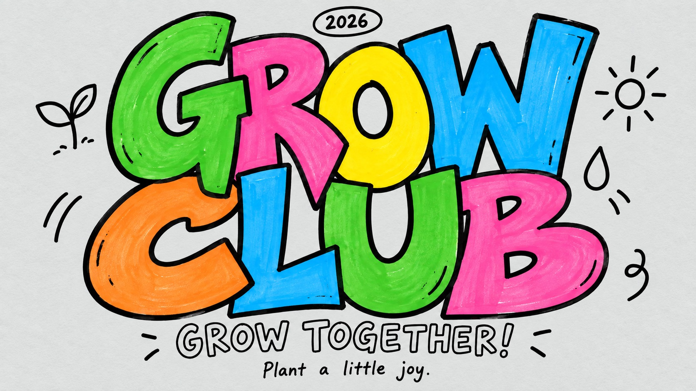

# Color Pop Interlocked Marker Type



Dense playful hand-drawn megatype: irregular interlocking colored letters, bold black contours, sparse doodles and neutral paper.

## Copy Prompt

Default case: `grow-club`

```text
Use the "Color Pop Interlocked Marker Type" visual style as the locked style.

Create a 16:9 image.

Subject: [your the interlocked hand-drawn two-word headline itself; the letters are the illustration, no separate figure]
Action: [your oversized letters pressing into each other and stretching across the two tiers]
Prop / product: [your no product; the small hand-written oval badge acts as the only prop-like element]
Location: [your a flat neutral warm-paper poster field with no scene]
Background: [your sparse unfilled black line doodles scattered in the margins]
Main text: [your the two-word headline built from WORD_ONE and WORD_TWO]
Secondary text: [your the hollow-outline invitation line and the casual handwritten footer]
Accent symbol: [your the small hand-written oval badge]
Styling: [your not applicable; express theme through letter colors and doodle motifs instead of clothing]

Style direction:
Dense playful hand-drawn megatype: irregular interlocking colored letters, bold black contours,
sparse doodles and neutral paper.

Keep visible:
- [CORE] Giant individually hand-drawn uppercase letters form a dense interlocking two-word mass, with exaggerated unequal widths, stretched stems, irregular baselines and slight overlaps.
- [CORE] Every major letter has a thick imperfect black marker contour and one vivid flat color; counters remain open and words readable.
- [CORE] Very light cool gray paper (#e4e7e5 approximate) surrounds the lettering, with delicate evenly distributed paper grain; the identical paper color fills all letter counters and hollow text. No bright pure white or yellow aging.
- [CORE] Small loose black contour doodles sit around the letter mass; typography is the subject, never a backdrop to a large character.
- [CORE] Main filled lettering is followed by a smaller hollow-outline uppercase invitation and a casual handwritten footer.

Avoid:
No watermark, source brand, rabbit, photographs, 3D extrusion, shadows, uniform typesetting,
pastel wash, beige paper, confetti flood, missing letters or duplicated words.

Do not copy source content, real logos, watermarks, platform UI, QR codes, or exact
reference layouts. Keep the visual system, but change the subject, text, and scene.
```

## Full Style

- [Open style.json](../../styles/color-pop-interlocked-marker-type/style.json)
- [Open style folder](../../styles/color-pop-interlocked-marker-type/)

<!-- Generated by scripts/generate-copy-prompts.py. Do not edit manually. -->
