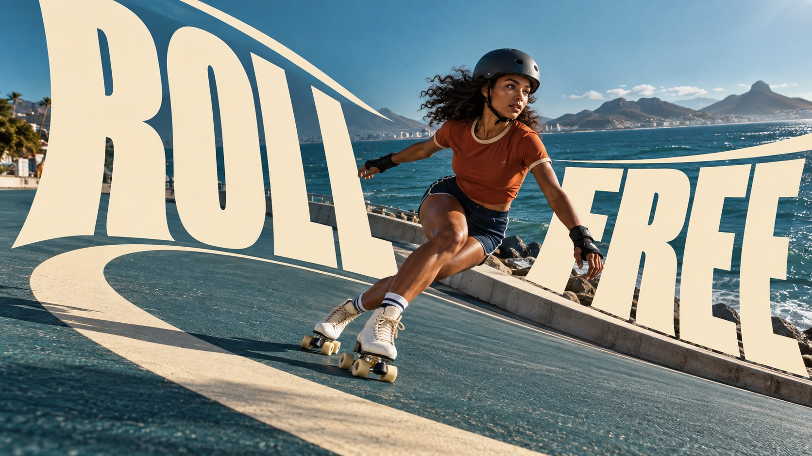

# Cream Curve Editorial



Sunlit photographic editorial posters shaped by monumental condensed cream lettering, elastic curves and deliberate subject/type depth exchanges. Each theme gives the lettering a different spatial job.

## Copy Prompt

Default case: `roll-free`

```text
Use the "Cream Curve Editorial" visual style as the locked style.

Create a 16:9 image.

Subject: [your New photographic subject and setting from SUBJECT_SCENE]
Action: [your Action that determines the lettering path and overlap]
Prop / product: [your Objects that interlock with the cream letterforms]
Location: [your Sunlit editorial environment carrying the photograph]
Background: [your Deep cool or earthy shadows and optional cream support curves]
Main text: ROLL FREE
Secondary text: [your No extra supporting copy beyond the exact headline]
Accent symbol: [your Small vivid color accent against warm cream type]
Styling: [your Wardrobe or object surfaces visible in the photograph]

Style direction:
Sunlit photographic editorial posters shaped by monumental condensed cream lettering, elastic
curves and deliberate subject/type depth exchanges. Each theme gives the lettering a different
spatial job.

Keep visible:
- [CORE] Monumental warm-cream uppercase lettering is an active spatial structure: extremely condensed heavy sans-serif glyphs with elastic vertical stretching, slant and smoothly warped contours. It dominates the graphic area while the complete headline remains readable.
- [CORE] Real sunlit editorial photography carries the image: direct hard daylight, dimensional natural detail, rich deep cool or earthy shadows and a small vivid color accent, contrasted with flat light-cream letterforms.
- [CORE] Integrate photograph and lettering through controlled foreground/background exchanges. At least one clear subject/type overlap must make depth legible while protecting the main action and crucial letters.
- [FLEX] Let the theme determine the typography path: a banking bend, radial groove, diving sweep or upward harvest fan are possibilities, not a shared layout.
- [FLEX] Choose the camera height, subject scale, focal placement, useful quiet areas and edge bleed for each case; a centered close-up portrait is not required.

Avoid:
Misspelled or repeated headline, unrelated extra copy, original subject or source identity
marks, malformed anatomy, repeated limbs, impossible machinery, unmotivated ribbons, identical
case layouts, generic straight heading, 3D beveled letters, gradients in type, cartoon
treatment, CGI skin, halftone, grunge, artificial edge sharpening, borders, watermarks.

Do not copy source content, real logos, watermarks, platform UI, QR codes, or exact
reference layouts. Keep the visual system, but change the subject, text, and scene.
```

## Full Style

- [Open style.json](../../styles/cream-curve-editorial/style.json)
- [Open style folder](../../styles/cream-curve-editorial/)

<!-- Generated by scripts/generate-copy-prompts.py. Do not edit manually. -->
