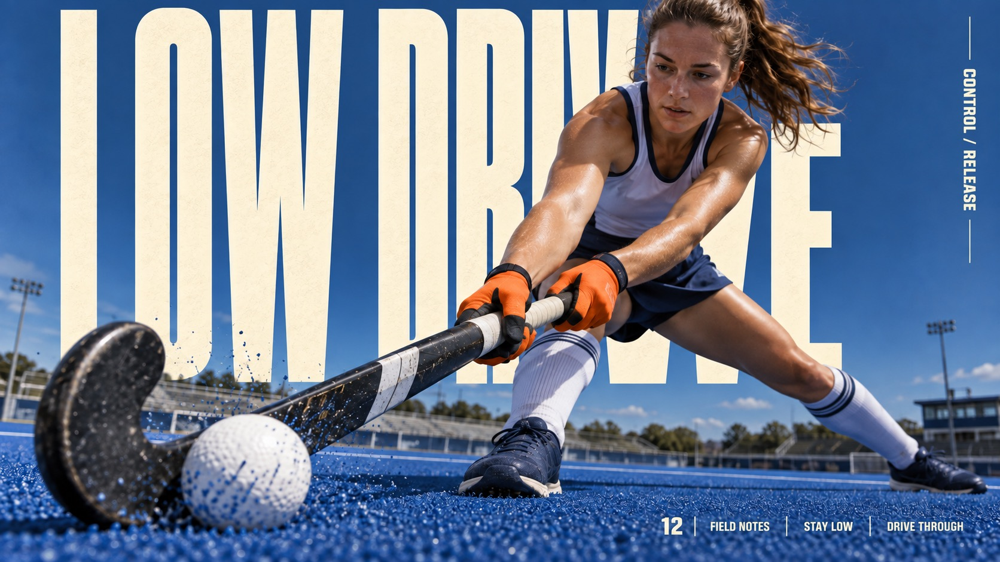

# Cream Megatype Impact Editorial



Close wide-angle action photographs interlocked with enormous warm-cream condensed background type, cobalt environmental depth, tactile ground or water, and a compact rule-divided editorial information rail.

## Copy Prompt

Default case: `turf-drive`

```text
Use the "Cream Megatype Impact Editorial" visual style as the locked style.

Create a 16:9 image.

Subject: An adult female field-hockey player in plain white/navy kit and orange gloves drives a small white ball on cobalt-blue outdoor turf. Low camera beside the curved hockey stick head; stick head in left foreground, continuous shaft connects to both hands, athlete in a deep planted lateral lunge behind it. Tiny turf granules at ball contact, dark-blue sky and distant low stadium structures.
Action: [your a compressed peak-impact athletic movement close to the lens]
Prop / product: [your the sport implement or ground material driving the impact moment]
Location: [your a cobalt-toned field, ring, water or gravel environment with deep wide-angle recession]
Background: [your enormous warm-cream condensed type behind the figure, plus spray, turf or gravel debris]
Main text: LOW DRIVE
Secondary text: [your the side rail label and the footer line of the editorial information block]
Accent symbol: [your the thin dividing rules of the editorial information rail]
Styling: [your sport-specific kit that separates cleanly from the cream type]

Style direction:
Close wide-angle action photographs interlocked with enormous warm-cream condensed background
type, cobalt environmental depth, tactile ground or water, and a compact rule-divided editorial
information rail.

Keep visible:
- [CORE] A close low wide-angle photograph puts one relevant equipment part or limb near the lens and a large connected athlete behind it; visible ground/water and natural displaced particles establish force and depth, not a floating sky-only cutout.
- [CORE] Enormous warm-cream ultra-condensed uppercase grotesk type acts as the background graphic plane, extending through much of the canvas and occluded by the photographed body/equipment. Show enough of each word to identify it; deliberate outer-edge bleed is possible but do not lose whole letters.
- [CORE] Cool cobalt or cyan-blue environmental field contrasts with warm cream type, pale neutral/dark navy sportswear, and one restrained warm physical accent. Hard daylight and believable shaded undersides give the action weight.
- [CORE] Compact cream editorial annotations, a large small-area issue number and thin rules make a restrained edge information system; keep it subordinate and integrated with the photo, never a large detached footer panel.
- [FLEX] Let the activity decide the leading near object, motion axis, horizon and type line breaks; choose distinct arcs, thrusts or lateral sweeps rather than repeat the source bat swing.

Avoid:
No logos, watermark, celebrity likeness, baseball uniform, bat, original slogan, neon lime,
starburst, decorative stars, detached limbs, extra fingers, disconnected equipment, illegible
words, old-paper tint, giant footer box.

Do not copy source content, real logos, watermarks, platform UI, QR codes, or exact
reference layouts. Keep the visual system, but change the subject, text, and scene.
```

## Full Style

- [Open style.json](../../styles/cream-megatype-impact-editorial/style.json)
- [Open style folder](../../styles/cream-megatype-impact-editorial/)

<!-- Generated by scripts/generate-copy-prompts.py. Do not edit manually. -->
