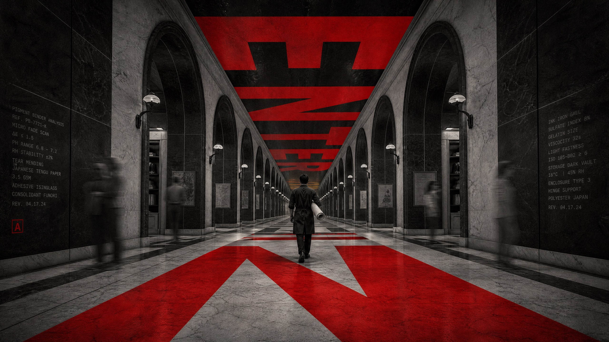

# Crimson Vanishing Point Editorial



A high-pressure editorial-poster system that turns a monochrome, ultra-wide one-point-perspective public interior into a typographic corridor. A lone central figure moves away from the viewer as enormous scarlet letters become receding floor, wall, and ceiling planes, while blurred peripheral bodies and faint technical text create urgency without clutter.

## Copy Prompt

Default case: `archive-conservator`

```text
Use the "Crimson Vanishing Point Editorial" visual style as the locked style.

Create a 16:9 image.

Subject: an adult archive conservator seen from behind as a dark slender silhouette
Action: walking forward while carrying a rolled restoration canvas under one arm
Prop / product: one plain rolled canvas secured with a dark strap, not a case or briefcase
Location: a grand but fictional marble library undercroft with repeated vaulted bays
Background: blurred visitors near the wall niches, soft overhead lamps, no bookshelves or transit details
Main text: ENTER
Secondary text: CATALOGUE 04 / CONTINUE FORWARD
Accent symbol: SMALL RED ARCHIVE TICK
Styling: long charcoal work coat, dark trousers, plain leather shoes

Style direction:
A high-pressure editorial-poster system that turns a monochrome, ultra-wide one-point-
perspective public interior into a typographic corridor. A lone central figure moves away from
the viewer as enormous scarlet letters become receding floor, wall, and ceiling planes, while
blurred peripheral bodies and faint technical text create urgency without clutter.

Keep visible:
- Use a strongly centered one-point perspective inside a long monumental public interior, with repeated bays, arches, ceiling ribs, or light fixtures converging at a single deep vanishing point.
- Render the architecture almost entirely in high-contrast black, white, and silver-gray, with coarse photographic grain and a slightly documentary, low-light feel.
- Place one lone adult figure on the central axis, walking away or moving forward into the depth of the corridor, with the body read primarily as a dark silhouette.
- Keep the central figure smaller than the architecture and typography, approximately 15–25% of canvas height, so the space and word planes dominate the drama.
- Add one to three enormous scarlet-red uppercase word fragments or geometric letter planes aligned to the exact vanishing-point perspective, appearing on the floor, ceiling, or spanning the central corridor.

Avoid:
No original subway, no platform, no transit signage, no man in black suit, no briefcase, no
source giant word or glyph sequence, no source prose, no exact tunnel geometry, no logo, no
watermark, no QR code, no readable real location sign, no blue/yellow/green/orange/purple, no
multicolor neon, no flat red title pasted over photo, no center crowd, no glossy stock image, no
weak perspective, no distorted body, and no illegible headline.

Do not copy source content, real logos, watermarks, platform UI, QR codes, or exact
reference layouts. Keep the visual system, but change the subject, text, and scene.
```

## Full Style

- [Open style.json](../../styles/crimson-vanishing-point-editorial/style.json)
- [Open style folder](../../styles/crimson-vanishing-point-editorial/)

<!-- Generated by scripts/generate-copy-prompts.py. Do not edit manually. -->
