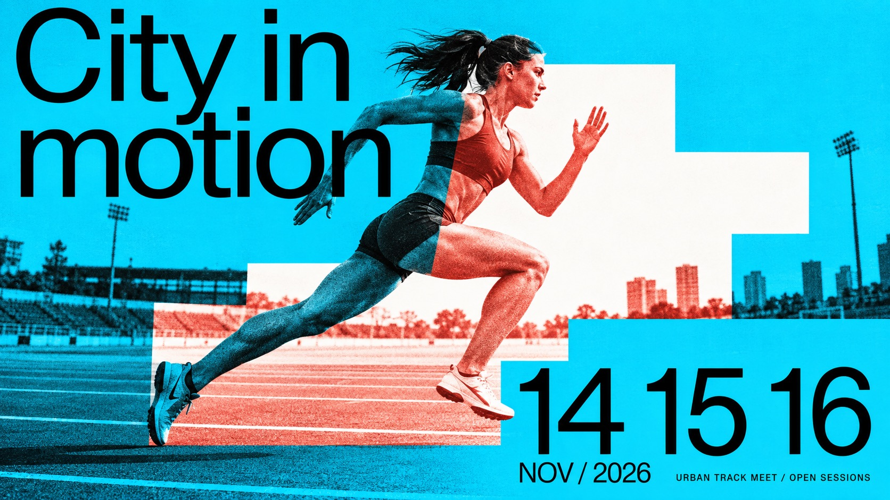

# Duotone Step Window Editorial



Oversized regular-weight grotesk typography, emphatic event numerals and a continuous grainy action photograph selectively re-inked through hard-edged stepped color windows.

## Copy Prompt

Default case: `city-stride`

```text
Use the "Duotone Step Window Editorial" visual style as the locked style.

Create a 16:9 image.

Subject: A fictional adult woman sprinting on an urban athletics track, side-on low-angle photo, rear leg extending back and forward knee lifted, dynamic but natural anatomy, simple unbranded running kit; sparse lane lines visible
Action: [your a continuous mid-action movement running across the stepped windows]
Prop / product: [your no separate product; the stepped color windows act as the framing device]
Location: [your a flat editorial poster field laid over one continuous grainy action photograph]
Background: [your hard-edged stepped color windows re-inking parts of the photograph, plus the event numerals]
Main text: City in motion
Secondary text: [your the date label and the footer line]
Accent symbol: [your the emphatic oversized event numerals]
Styling: [your plain contemporary clothing that stays readable through the duotone re-inking]

Style direction:
Oversized regular-weight grotesk typography, emphatic event numerals and a continuous grainy
action photograph selectively re-inked through hard-edged stepped color windows.

Keep visible:
- [CORE] An oversized regular-to-medium weight neo-grotesk headline and emphatic date numerals build an asymmetric, tightly set editorial hierarchy; no heavy condensed display, serif, outline or hand-lettered headline.
- [CORE] One continuous action photograph crosses hard rectangular or stepped masks: outside the light window it is black-on-saturated-base duotone, inside it is contrasting spot-ink-on-neutral-white. Image geometry remains aligned through every boundary.
- [CORE] Flat vivid color fields, white windows and restrained photographic print grain create a sharp graphic/photographic contrast; no natural-color portrait inset or photorealistic paper mockup.
- [FLEX] Design the stepped window to answer the action: its scale, position, contour and number of turns can change; the reference's exact silhouette and cyclist diagonal are not fixed.
- [FLEX] Choose a vivid base and a contrasting spot ink for each theme, keeping black text and light-window contrast strong. Blue and red are a valid example, not a compulsory universal palette.

Avoid:
No source event, sponsor, watermark, source portrait or cycling scene; no natural-color inset,
repeated person, disconnected anatomy, transparent canvas, generic scrapbook boxes, serif
lettering, pastel wash, grunge scratches or unreadable required title.

Do not copy source content, real logos, watermarks, platform UI, QR codes, or exact
reference layouts. Keep the visual system, but change the subject, text, and scene.
```

## Full Style

- [Open style.json](../../styles/duotone-step-window-editorial/style.json)
- [Open style folder](../../styles/duotone-step-window-editorial/)

<!-- Generated by scripts/generate-copy-prompts.py. Do not edit manually. -->
