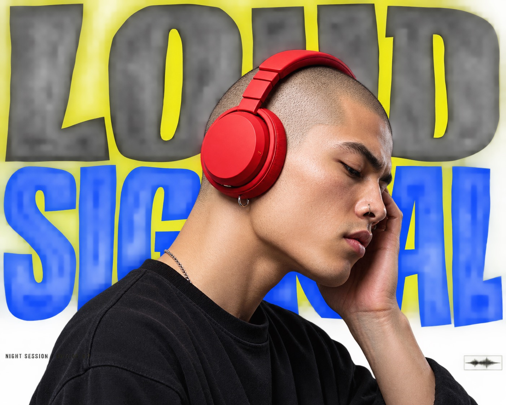

# Electric Yellow Cutout Megatype Poster Style



A high-impact pop advertising poster system that places one oversized photoreal cutout subject over monumental warped display lettering, using an electric-yellow field, black upper type, cobalt-blue lower type, severe cropping, and tiny editorial metadata for scale contrast.

## Copy Prompt

Default case: `signal-headphones`

```text
Use the "Electric Yellow Cutout Megatype Poster Style" visual style as the locked style.

Create a 16:9 image.

Subject: a shaved-head music producer in sharp three-quarter profile wearing oversized scarlet studio headphones
Action: tilting their head forward with one ear cup pressed close while listening intently
Prop / product: matte scarlet over-ear headphones with a thick coiled cable
Location: a seamless electric-yellow studio poster field
Background: monumental cropped black upper lettering, monumental cropped cobalt lower lettering, and one tiny vertical edition label
Main text: LOUD SIGNAL
Secondary text: NIGHT SESSION / EDITION 07
Accent symbol: a small outlined waveform stamp
Styling: plain black crewneck with a clean collar and no visible branding

Style direction:
A high-impact pop advertising poster system that places one oversized photoreal cutout subject
over monumental warped display lettering, using an electric-yellow field, black upper type,
cobalt-blue lower type, severe cropping, and tiny editorial metadata for scale contrast.

Keep visible:
- One enormous photoreal cutout subject occupies the center and overlaps both typographic bands.
- The backdrop is a nearly edge-to-edge field of pure electric yellow with only a narrow outer breathing margin.
- Monumental black display letters dominate the upper half while monumental cobalt-blue letters dominate the lower half.
- Headline letters are ultra-heavy, tightly packed, irregularly compressed, softly warped, and aggressively cropped by the frame.
- The composition is front-facing and poster-flat, with depth created only by the photographic cutout crossing in front of the type.

Avoid:
burger, sandwich, bun, lettuce, fried food, handheld food, hand gripping food, cobalt manicure,
dripping sauce, bare forearm food pose, DIRTY, BURGER, POSTER, EVENT, 28 NOVEMBER 2023, original
logo, original seal, copied source layout, identifiable brand, watermark, username, creator ID,
QR code, platform logo, realistic room, street, landscape, tabletop, crowd, multiple subjects,
dense props, gradient, pastel palette, rainbow palette, 3D typography, chrome type, glossy
inflated letters, serif headline, script headline, thin corporate type, halftone, photocopy
distress, paper tear, film grain, heavy noise, soft edges, blurry cutout

Do not copy source content, real logos, watermarks, platform UI, QR codes, or exact
reference layouts. Keep the visual system, but change the subject, text, and scene.
```

## Full Style

- [Open style.json](../../styles/electric-yellow-cutout-megatype-poster-style/style.json)
- [Open style folder](../../styles/electric-yellow-cutout-megatype-poster-style/)

<!-- Generated by scripts/generate-copy-prompts.py. Do not edit manually. -->
