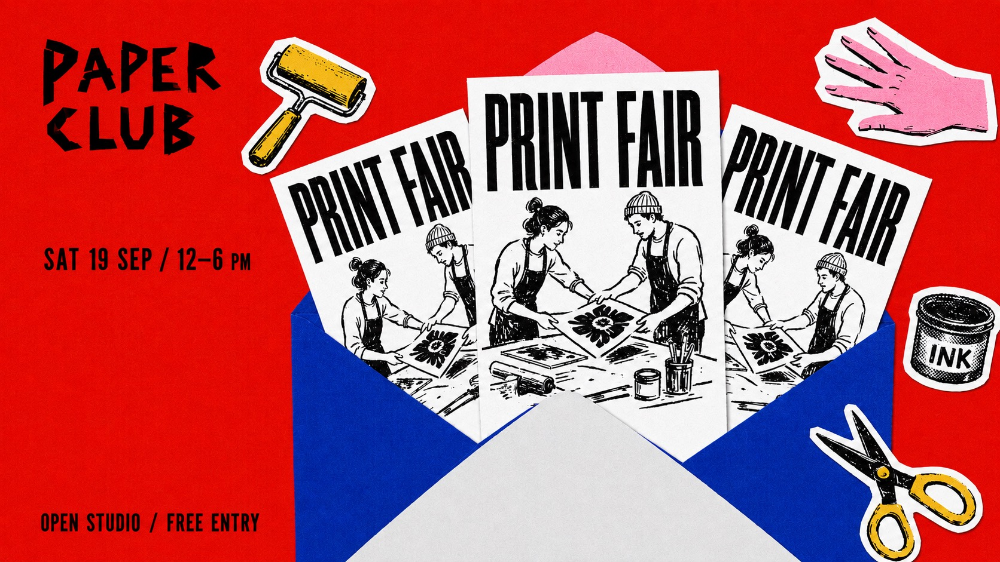

# Grainy Envelope Flyer Collage



A tactile event poster built around repeated photocopied flyers emerging from a saturated paper envelope, framed by cutout icons and spare black type.

## Copy Prompt

Default case: `print-social`

```text
Use the "Grainy Envelope Flyer Collage" visual style as the locked style.

Create a 16:9 image.

Subject: [your three tilted photocopied flyers emerging from a large open paper envelope]
Action: [your flyers fanning upward out of the envelope at different angles]
Prop / product: [your the saturated open paper envelope with visible triangular side folds]
Location: [your a flat saturated cut-paper poster field with no realistic scene]
Background: [your orbiting cutout sticker icons and coarse print grain around the envelope]
Main text: PRINT FAIR
Secondary text: [your the cut-paper masthead, the short date line and the footer line]
Accent symbol: [your the cutout sticker icons orbiting the envelope]
Styling: [your not applicable; any figures appear only inside the monochrome flyer drawing]

Style direction:
A tactile event poster built around repeated photocopied flyers emerging from a saturated paper
envelope, framed by cutout icons and spare black type.

Keep visible:
- [CORE] An open colored paper envelope holds three overlapping cool white event flyers, fanning upward at different small angles; visible triangular envelope folds anchor the lower collage.
- [CORE] Each flyer repeats the same bold black condensed headline and rough monochrome line illustration; at least one headline is fully visible.
- [CORE] A compact irregular cut-paper masthead and small factual text occupy open background outside the central stack.
- [CORE] Several theme-specific cutout stickers orbit the stack with selective white borders, varied scale and shallow overlaps.
- [CORE] Flat printed collage with fine paper grain and rough ink lines, not a dimensional product photograph.

Avoid:
No source logos, no watermarks, no photographic mockup, no glossy 3D rendering, no extra
paragraphs, no arbitrary grunge damage, no cropped primary headline.

Do not copy source content, real logos, watermarks, platform UI, QR codes, or exact
reference layouts. Keep the visual system, but change the subject, text, and scene.
```

## Full Style

- [Open style.json](../../styles/grainy-envelope-flyer-collage/style.json)
- [Open style folder](../../styles/grainy-envelope-flyer-collage/)

<!-- Generated by scripts/generate-copy-prompts.py. Do not edit manually. -->
