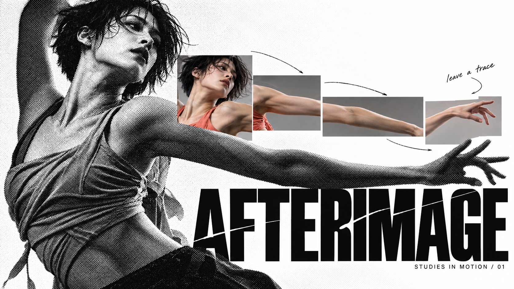

# Halftone Chroma Fragment Editorial



High-contrast editorial collage in which monumental coarse black-and-white photographic halftones interact with selective crisp color fragments, heavy display typography and sparse handwritten interventions.

## Copy Prompt

Default case: `afterimage`

```text
Use the "Halftone Chroma Fragment Editorial" visual style as the locked style.

Create a 16:9 image.

Subject: Fictional adult contemporary dancer with short dark hair wearing a sculptural coral practice top, caught in a long twisting arm gesture; expressive clean studio photography
Action: [your a charged gesture rendered as a monumental coarse halftone]
Prop / product: [your the isolated crisp color fragment cut into the halftone field]
Location: [your a flat high-contrast collage field rather than a real setting]
Background: [your coarse black-and-white halftone texture, torn edges and sparse handwritten interventions]
Main text: AFTERIMAGE
Secondary text: STUDIES IN MOTION / 01
Accent symbol: [your the handwritten annotation mark]
Styling: [your simple clothing whose shapes survive heavy halftone posterization]

Style direction:
High-contrast editorial collage in which monumental coarse black-and-white photographic
halftones interact with selective crisp color fragments, heavy display typography and sparse
handwritten interventions.

Keep visible:
- [CORE] A monumental photographic image rendered in coarse high-contrast black-and-white halftone forms the dominant visual field, with recognizable silhouette and intentional cropped scale.
- [CORE] A small set of crisp full-color photographic fragments contrasts with the monochrome image; fragments reveal, reconnect or interrupt the main subject rather than acting as unrelated decorations.
- [CORE] Heavy graphic display type and restrained editorial text contrast with sparse hand-drawn annotations; readable hierarchy remains clear amid image overlap.
- [FLEX] Recompose the visual field for each theme: placement, image-window geometry, fragment count and negative-space rhythm are open, while retaining monochrome dominance and selective color.
- [FLEX] Choose theme-led accent colors and photo lighting; preserve clean tonal separation, with no automatic beige aging or compulsory reference red.

Avoid:
No source brand or identity, watermarks, mockup frame, beige aging, all-over coarse paper grain,
unreadable required title, duplicated limbs, irrelevant stickers, random contact-sheet grid or
identical layout across cases.

Do not copy source content, real logos, watermarks, platform UI, QR codes, or exact
reference layouts. Keep the visual system, but change the subject, text, and scene.
```

## Full Style

- [Open style.json](../../styles/halftone-chroma-fragment-editorial/style.json)
- [Open style folder](../../styles/halftone-chroma-fragment-editorial/)

<!-- Generated by scripts/generate-copy-prompts.py. Do not edit manually. -->
