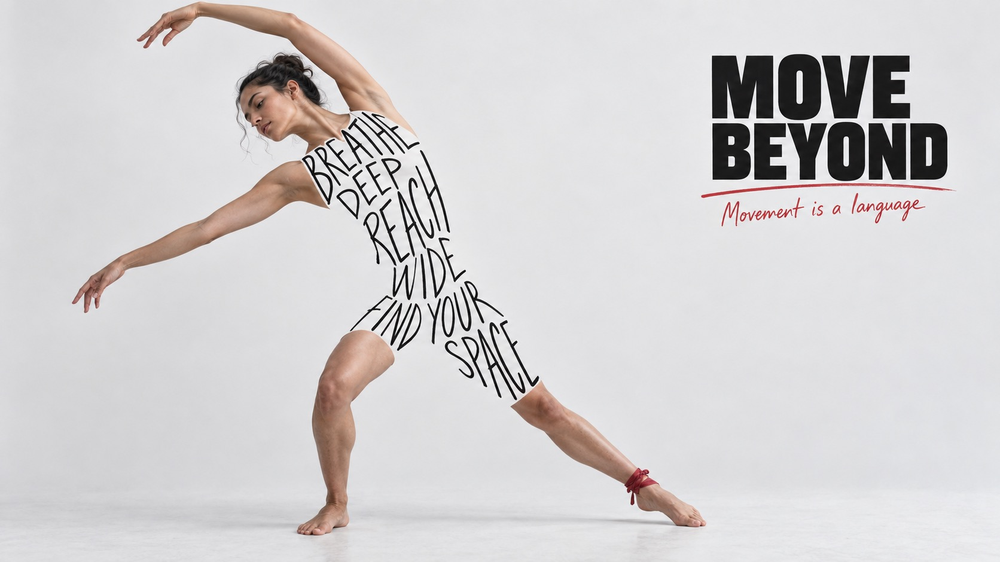

# Ink Body Manifesto



Realistic figures on pale gray-white ground, their torsos constructed from irregular black handwriting, with a compact heavy black headline and sparse red handwritten marks.

## Copy Prompt

Default case: `move-beyond`

```text
Use the "Ink Body Manifesto" visual style as the locked style.

Create a 16:9 image.

Subject: An adult woman contemporary dancer with natural dark hair tied back, in an expressive standing side-bend, one arm curves overhead toward the left and the other opens sideways. Both feet grounded, one leg extended sideways with a small crimson ankle wrap; exposed arms, head, and lower legs are photographed.
Action: [your Pose that the letter-built torso must follow]
Prop / product: [your Single practical prop plus one small red subject detail]
Location: [your Pale gray-white seamless photographic ground]
Background: [your Quiet negative space around the figure]
Main text: MOVE BEYOND
Secondary text: Movement is a language
Accent symbol: [your Spare red underline, circle or short stroke]
Styling: [your Exposed photographic head, limbs and remaining garments around the letter torso]

Style direction:
Realistic figures on pale gray-white ground, their torsos constructed from irregular black
handwriting, with a compact heavy black headline and sparse red handwritten marks.

Keep visible:
- [CORE] The central visual trick is a human body constructed from irregular black hand-lettered words. Remove the photographic torso and upper garment and replace that area with background-colored negative space filled by letters; the collective outer edges of the letters create the silhouette. It must not look like text printed on a white shirt, a rectangular sign, or a tattoo.
- [CORE] Keep the head, exposed arms, hands and lower legs photographic and anatomically connected to the letter-built silhouette, so the figure remains one coherent person.
- [CORE] Body lettering is slender, elongated, single-stroke black felt-tip handwriting, NOT bold brush lettering or a heavy display font. Stroke width roughly one fifteenth of letter height. Narrow irregular uppercase glyphs, varying heights and gently wavering baselines fit the body volume. Air between strokes is essential, every word legible.
- [CORE] A pale gray-white seamless photographic ground with generous quiet negative space supports almost-black ink and very limited muted crimson accents; no rich scene or colorful graphic backdrop.
- [CORE] A SMALL compact block of extra-bold wide uppercase sans-serif headline contrasts with the slender body handwriting. Keep headline clearly secondary to the figure, roughly a quarter of canvas width, with a short small crimson handwritten subline.

Avoid:
No football, no source slogan or names, no brands or logos, no white slogan shirt, no
rectangular text sticker, no torso photograph underneath letters, no colored torso panel, no
random letters or repeated copy, no extra limbs, no dismemberment, no busy background, no large
red shapes, no tiny fake legal text. No heavy brush body lettering, no solid white clothing
silhouette, no giant condensed headline, no dirty grunge floor.

Do not copy source content, real logos, watermarks, platform UI, QR codes, or exact
reference layouts. Keep the visual system, but change the subject, text, and scene.
```

## Full Style

- [Open style.json](../../styles/ink-body-manifesto/style.json)
- [Open style folder](../../styles/ink-body-manifesto/)

<!-- Generated by scripts/generate-copy-prompts.py. Do not edit manually. -->
