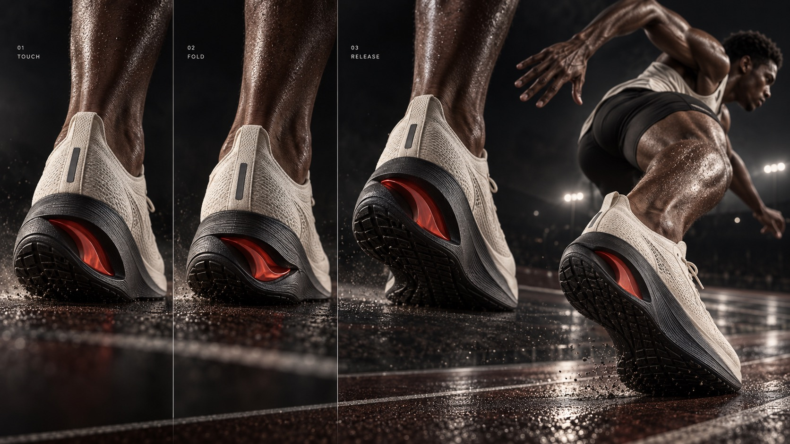

# Kinetic Footwear Process



A premium, motion-led footwear campaign turns athletic movement into a compact visual process story: a newly invented shoe mechanism is shown through action, sequential states and tactile engineering close-ups, with restrained micro-labels.

## Copy Prompt

Default case: `impact-window`

```text
Use the "Kinetic Footwear Process" visual style as the locked style.

Create a 16:9 image.

Subject: A male track sprinter landing hard in a low forward-driving pose, shoe filling the near foreground
Action: [your Decisive athletic movement that reveals the mechanism]
Prop / product: [your Original footwear architecture for this case]
Location: [your Premium athletic environment serving the process story]
Background: [your Motion traces, cutaways and tactile material close-ups]
Main text: [your Restrained campaign title if lettering appears]
Secondary text: [your Only short stage labels, rendered very small]
Accent symbol: [your Warm vermilion confined to a functional shoe part or process cue]
Styling: [your Performance kit that keeps the shoe readable]

Style direction:
A premium, motion-led footwear campaign turns athletic movement into a compact visual process
story: a newly invented shoe mechanism is shown through action, sequential states and tactile
engineering close-ups, with restrained micro-labels.

Keep visible:
- [CORE] Fuse high-end athletic campaign photography with precise footwear product imagery; show movement and engineering as one connected story.
- [CORE] Let an athlete, foot or shoe move through a decisive action; use close crops, low camera angles and strong perspective to make the product feel physical and immediate.
- [CORE] Explain the shoe through three ordered visual states, a cutaway, an exploded construction or tactile material details; the functional change must be visible without long copy.
- [CORE] Use a controlled palette of obsidian, warm bone and deep vermilion; confine the warm accent to a functional shoe component, motion trace or small process cue.
- [CORE] Build premium depth with sculpted directional light, precise contact shadows, tactile knit/rubber/carbon surfaces and fine restrained grain.

Avoid:
No oversized headline, giant typography, slogan, brand mark, swoosh, trademark, copied source
shoe, repeated circular pod outsole, exact Pegasus or Reebok silhouette, broad red gradient,
candy-plastic material, generic catalogue product pose, crowded HUD, fake paragraphs, browser
UI, gallery thumbnails, meaningless arrows, unreadable process order, distorted joints,
malformed feet, duplicate shoes, floating unrelated objects or low-resolution texture.

Do not copy source content, real logos, watermarks, platform UI, QR codes, or exact
reference layouts. Keep the visual system, but change the subject, text, and scene.
```

## Full Style

- [Open style.json](../../styles/kinetic-footwear-process/style.json)
- [Open style folder](../../styles/kinetic-footwear-process/)

<!-- Generated by scripts/generate-copy-prompts.py. Do not edit manually. -->
