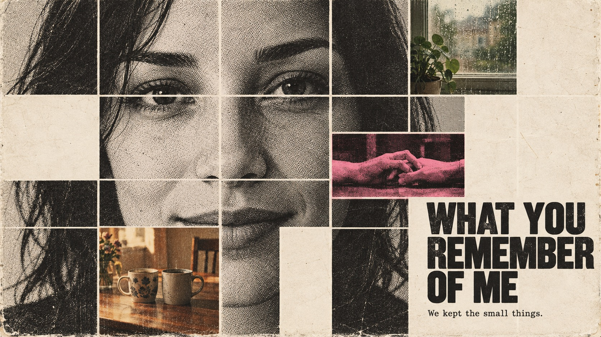

# Memory Fragment Portrait



A coarse-halftone black-and-white portrait tiled by a regular white grid; selected cells become faded life photographs, blank paper, and one fluorescent-pink key memory. From afar it is a face; up close it is a relationship.

## Copy Prompt

Default case: `table-for-two`

```text
Use the "Memory Fragment Portrait" visual style as the locked style.

Create a 16:9 image.

Subject: An invented woman around thirty, dark shoulder-length hair, front-facing quiet gaze and a slight almost-smile; face close-up, no hands on face.
Action: [your How the face is interrupted by memory cells, blanks and title]
Prop / product: [your Concrete memory objects inside replacement cells]
Location: [your Warm off-white printed paper with a regular white grid]
Background: [your Blank paper cells, gutters and xerographic wear]
Main text: WHAT YOU REMEMBER OF ME
Secondary text: We kept the small things.
Accent symbol: [your Single fluorescent pink-and-black memory tile]
Styling: [your Portrait clothing and hair visible in the remaining face tiles]

Style direction:
A coarse-halftone black-and-white portrait tiled by a regular white grid; selected cells become
faded life photographs, blank paper, and one fluorescent-pink key memory. From afar it is a
face; up close it is a relationship.

Keep visible:
- [CORE] At a glance the dominant picture is ONE coherent recognizable human face, divided into aligned rectangular photo tiles by narrow off-white gutters. The facial tiles are crops of one continuous portrait, not different portraits or randomly rearranged features.
- [CORE] Replace a small minority of face-grid cells with discrete photographs of shared everyday memories. These memory photographs occupy whole cells inside the facial mosaic, never as a separate moodboard beside the face and never as translucent double exposure.
- [CORE] Leave selected grid cells completely empty as warm off-white paper. These absences interrupt the portrait meaningfully while enough eye, nose and mouth information remains to recognize a face.
- [CORE] Dominant facial tiles use harsh black-and-white coarse newspaper halftone dots and slightly broken xerographic ink. Memory inserts use muted faded analog color, with exactly one small fluorescent pink-and-black memory tile as an emotional anchor.
- [CORE] Use tactile off-white printed paper, visibly structured halftone and restrained wear; strong black grotesk lettering shares the grid and occupies a missing or merged-cell space instead of floating as an unrelated caption.

Avoid:
No source identities or names, no FORK or HER, no credits or watermarks, no duplicated eyes, no
random tiles from unrelated faces, no full color main face, no smooth grayscale replacing
halftone, no collage stuck beside a complete portrait, no translucent double exposure, no more
than one pink tile, no illegible title, no simulated tape or excessive damage.

Do not copy source content, real logos, watermarks, platform UI, QR codes, or exact
reference layouts. Keep the visual system, but change the subject, text, and scene.
```

## Full Style

- [Open style.json](../../styles/memory-fragment-portrait/style.json)
- [Open style folder](../../styles/memory-fragment-portrait/)

<!-- Generated by scripts/generate-copy-prompts.py. Do not edit manually. -->
