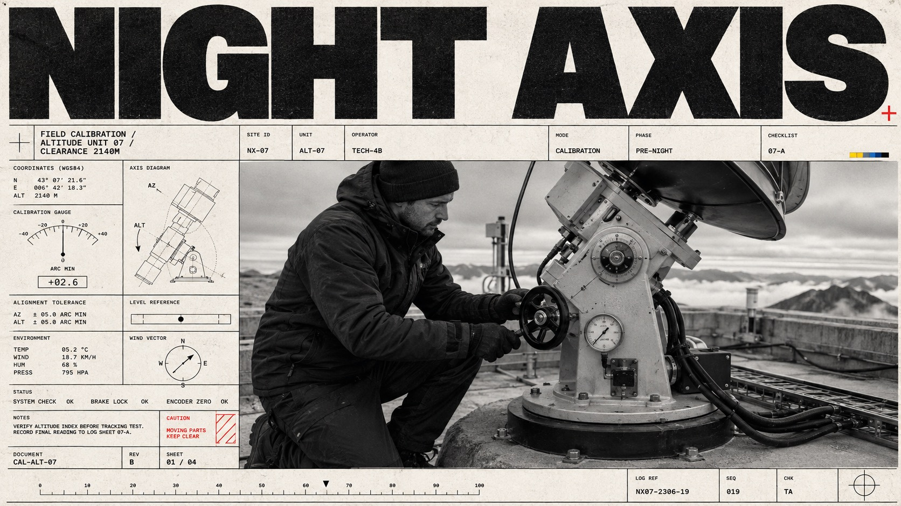

# Monochrome Tech-Grid Editorial



A severe black-and-white editorial poster system that combines an oversized compressed headline, a dense modular field of technical micro-information, and one documentary photograph cropped with monumental scale. Off-white paper, distressed ink, thin rules, registration motifs, and a restrained safety-red accent make the layout feel like an experimental identity manual crossed with an archival industrial contact sheet.

## Copy Prompt

Default case: `observatory-night-shift`

```text
Use the "Monochrome Tech-Grid Editorial" visual style as the locked style.

Create a 16:9 image.

Subject: an observatory technician beside a compact radio telescope mount
Action: tightening the altitude mechanism before a night calibration
Prop / product: a hand wheel, calibration gauge, and compact telescope assembly
Location: a windswept mountain observatory platform at dusk
Background: low guardrails, distant cloud layers, cable trays, and concrete decking
Main text: NIGHT AXIS
Secondary text: FIELD CALIBRATION / ALTITUDE UNIT 07 / CLEARANCE 2140M
Accent symbol: +
Styling: dark insulated utility jacket, plain work trousers, and protective gloves with no logos

Style direction:
A severe black-and-white editorial poster system that combines an oversized compressed headline,
a dense modular field of technical micro-information, and one documentary photograph cropped
with monumental scale. Off-white paper, distressed ink, thin rules, registration motifs, and a
restrained safety-red accent make the layout feel like an experimental identity manual crossed
with an archival industrial contact sheet.

Keep visible:
- One immense black grotesk headline dominates the uppermost layer, tightly tracked and cropped close to the outer edges.
- A rigid Swiss-influenced modular grid of thin black rules divides the information zone into many unequal technical panels.
- The layout is intentionally dense yet disciplined, with tiny metadata contrasted against a single oversized word and a single oversized photograph.
- One high-contrast black-and-white documentary photograph occupies roughly the lower half in portrait formats or the dominant right/lower field in landscape formats.
- The photographed subject is cropped boldly at the frame edges and seen from a straightforward eye-level or slightly low documentary viewpoint.

Avoid:
rally car, racecar, motorsport, racetrack, racing driver, door number 553, sponsor decals,
TenSecond, T-023, original identity copy, copied layout modules, QR code, scannable barcode,
watermark, signature, creator name, real logo, brand mark, glossy 3D render, neon palette,
gradient, cinematic color photo, lifestyle advertising, scrapbook collage, chaotic UI, excessive
glitch, heavy noise, text soup, illegible headline, distorted typography, fake paragraphs,
fisheye, centered product cutout

Do not copy source content, real logos, watermarks, platform UI, QR codes, or exact
reference layouts. Keep the visual system, but change the subject, text, and scene.
```

## Full Style

- [Open style.json](../../styles/monochrome-tech-grid-editorial/style.json)
- [Open style folder](../../styles/monochrome-tech-grid-editorial/)

<!-- Generated by scripts/generate-copy-prompts.py. Do not edit manually. -->
