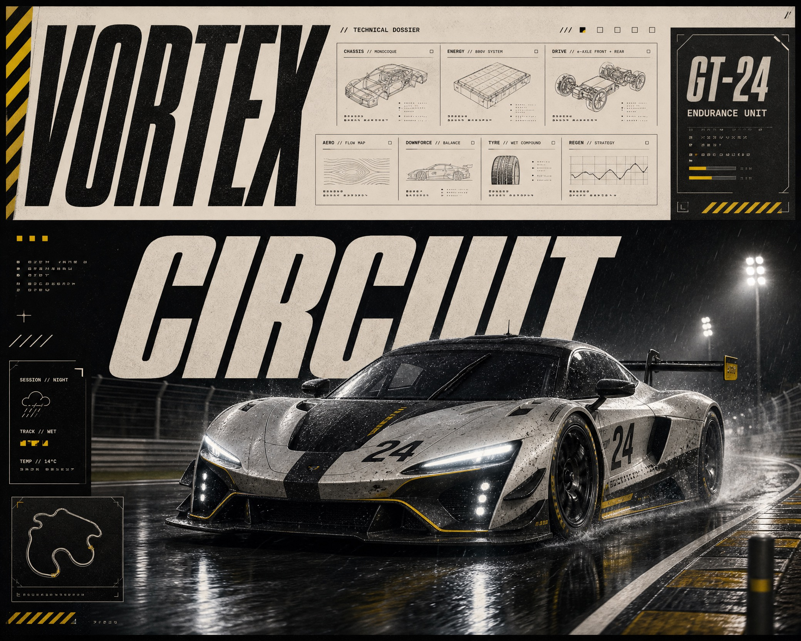

# Motorsport Technical Editorial



A high-energy motorsport editorial visual system that combines a dramatic original racing photograph with oversized condensed typography, industrial information cards, signal-yellow accents, and disciplined technical-document graphic grammar.

## Copy Prompt

Default case: `night-arc`

```text
Use the "Motorsport Technical Editorial" visual style as the locked style.

Create a 16:9 image.

Subject: a fictional graphite-and-white electric GT race car marked 24
Action: charging through a rain-swept right-hand curve
Prop / product: a small yellow pit-radio antenna and blank wheel hubs
Location: a fictional endurance circuit under floodlights
Background: wet asphalt reflections, blurred pit wall lights, and a low safety fence
Main text: VOLTAGE
Secondary text: GT-24 / ENDURANCE UNIT
Accent symbol: diagonal yellow hazard stripe
Styling: no people; technical automotive editorial styling

Style direction:
A high-energy motorsport editorial visual system that combines a dramatic original racing
photograph with oversized condensed typography, industrial information cards, signal-yellow
accents, and disciplined technical-document graphic grammar.

Keep visible:
- Oversized italic condensed sans-serif headline cropped by the page edges
- Three-tier hierarchy that alternates between title bands, technical panels, and a dominant racing image
- High-contrast palette of near-black, warm off-white, graphite gray, and concentrated signal yellow
- Dense but disciplined editorial information blocks built from thin rules, outlined boxes, square markers, and small diagrams
- Low front three-quarter action perspective with the vehicle breaking across the graphic grid

Avoid:
Real brand logos, sponsor graphics, real racing teams, recognizable vehicle models, source car
livery, source wording, QR code, barcode, watermark, signature, copied panel positions, dense
readable microtext, illegible gibberish paragraphs, neon cyberpunk, generic video-game UI, muddy
noise, oversharpening, or accidental compression artifacts.

Do not copy source content, real logos, watermarks, platform UI, QR codes, or exact
reference layouts. Keep the visual system, but change the subject, text, and scene.
```

## Full Style

- [Open style.json](../../styles/motorsport-technical-editorial/style.json)
- [Open style folder](../../styles/motorsport-technical-editorial/)

<!-- Generated by scripts/generate-copy-prompts.py. Do not edit manually. -->
