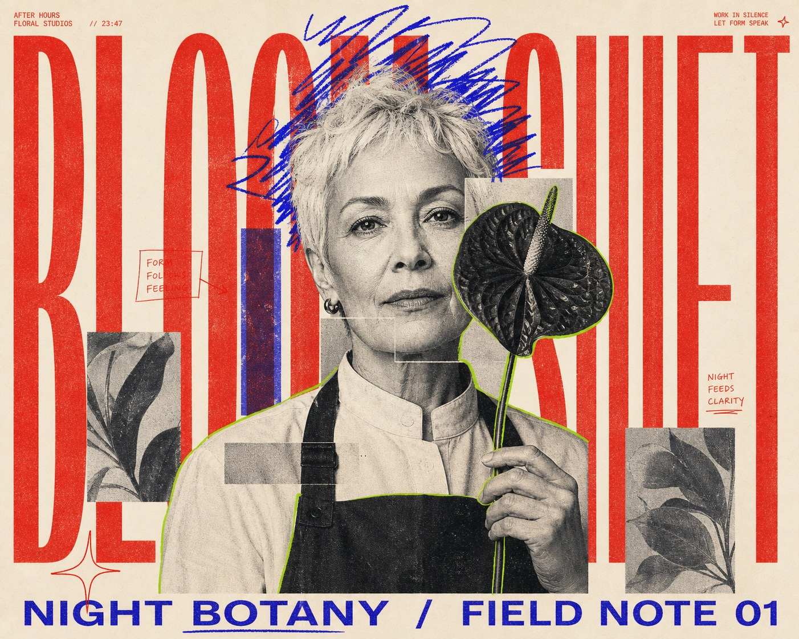

# Neon Scribble Editorial Poster



A confrontational editorial poster system built from monumental ultra-condensed red typography, one centrally cropped black-and-white halftone portrait, offset rectangular photo fragments, and spontaneous electric-blue and acid-green marker annotations on warm cream paper.

## Copy Prompt

Default case: `midnight-florist`

```text
Use the "Neon Scribble Editorial Poster" visual style as the locked style.

Create a 16:9 image.

Subject: an older female night florist with a silver cropped haircut and a calm direct gaze
Action: holding one sculptural flower stem upright beside her cheek
Prop / product: a single oversized anthurium with a dark graphic silhouette
Location: an abstract after-hours flower studio implied only by two faint botanical rectangles
Background: two screened leaf fragments and one narrow blue-violet block
Main text: BLOOM SHIFT
Secondary text: NIGHT BOTANY / FIELD NOTE 01
Accent symbol: a hand-drawn four-point star
Styling: matte black work apron over a pale high-collar shirt with no blazer or tie

Style direction:
A confrontational editorial poster system built from monumental ultra-condensed red typography,
one centrally cropped black-and-white halftone portrait, offset rectangular photo fragments, and
spontaneous electric-blue and acid-green marker annotations on warm cream paper.

Keep visible:
- A warm cream or pale peach uncoated-paper field remains visible around the composition, especially across the upper margin.
- One enormous red ultra-condensed uppercase headline spans nearly the full canvas and is cropped by at least two edges.
- A single centered chest-up or waist-up editorial portrait interrupts the giant letters, with typography passing both behind and in front of the figure.
- The portrait is predominantly black and white with coarse halftone grain, photocopy texture, high contrast, and a frontal near-eye-level camera.
- Several hard-edged rectangular image fragments offset parts of the face or torso, producing a restrained analog cut-and-paste mosaic rather than a chaotic collage.

Avoid:
MAXIMALISM, IN GRAPHIC DESIGN, BEGINNER GUIDE, ZEKA, ZEKAGRAPHIC.COM, source logo, source
website, copied red letter arrangement, exact source male face, source hairstyle, white suit
jacket, black shirt and tie, copied eye doodles, copied face-fragment offsets, graphic design
tutorial cover, real brand, real publication, logo, watermark, username, creator ID, URL, QR
code, platform UI, multiple people, crowd, scenic room, cinematic background, dramatic depth of
field, colored rim light, glossy 3D text, bevel, extruded lettering, gradient, rainbow palette,
polished vector graffiti, neon tube, dense stickers, torn-paper clutter, chaotic glitch,
excessive grain, muddy compression, low resolution, blur, malformed face, extra limbs, extra
fingers, illegible anatomy.

Do not copy source content, real logos, watermarks, platform UI, QR codes, or exact
reference layouts. Keep the visual system, but change the subject, text, and scene.
```

## Full Style

- [Open style.json](../../styles/neon-scribble-editorial-poster/style.json)
- [Open style folder](../../styles/neon-scribble-editorial-poster/)

<!-- Generated by scripts/generate-copy-prompts.py. Do not edit manually. -->
