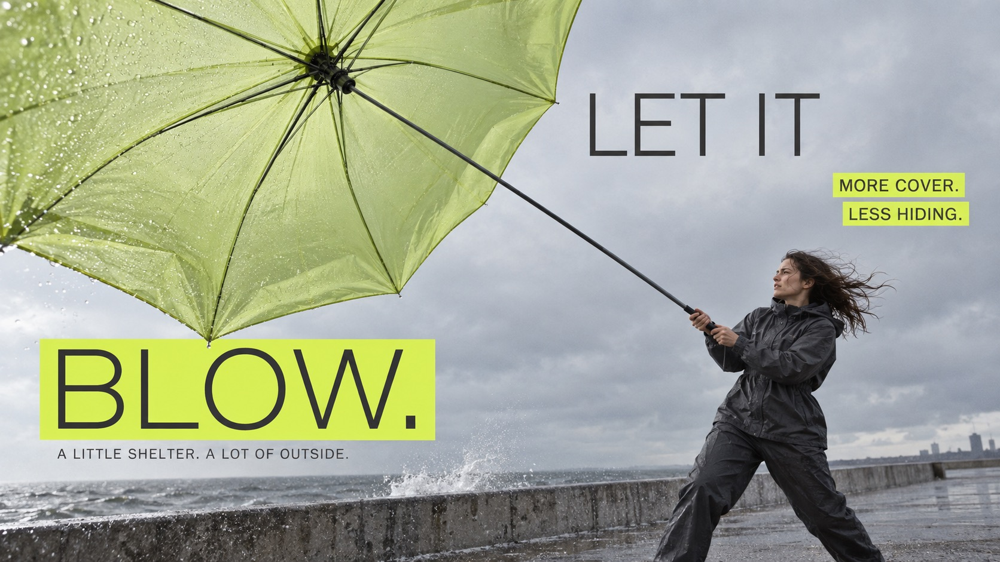

# Neon Strip Low Angle Campaign



Product-led oblique photography, muted grey environments and precise highlighter editorial typography; each product generates a distinct composition.

## Copy Prompt

Default case: `rain-side`

```text
Use the "Neon Strip Low Angle Campaign" visual style as the locked style.

Create a 16:9 image.

Subject: One adult woman in charcoal rainwear grounded on a windswept concrete embankment, side profile leaning against wind, both hands holding an umbrella shaft. Large near translucent pale-lime canopy at upper left, smaller woman lower right. The straight central shaft must visibly run from her hands all the way to the central umbrella hub where every rib radiates; do not attach the shaft to a rim rib. Muted grey sky and narrow wet concrete ground.
Action: [your the product presented at an oblique low angle as the campaign hero]
Prop / product: [your the single hero product driving the composition]
Location: [your a muted grey studio or everyday environment with restrained depth]
Background: [your flat grey surfaces, one soft shadow and the highlighter-colored strip]
Main text: LET IT BLOW.
Secondary text: [your the body copy block and the small callout labels]
Accent symbol: [your the highlighter-colored strip running through the layout]
Styling: [your keep any clothing plain and unbranded so the product stays dominant]

Style direction:
Product-led oblique photography, muted grey environments and precise highlighter editorial
typography; each product generates a distinct composition.

Keep visible:
- [CORE] Constructed regular-weight rounded sans uppercase headline with even lean strokes and precise counters; supporting type is plain regular neo-grotesk. No marker, brush or extra-bold display lettering.
- [CORE] Bright sharp-corner flat rectangular highlights and dark type form an asymmetric editorial hierarchy: large headline, medium annotations, compact body. Place bands in content-shaped negative space, not a mandatory top stack.
- [CORE] Oblique wide-angle product photography with purposeful near/far scale, subdued grey environment and fine photographic print grain. Product function and believable human interaction lead the visual composition.
- [FLEX] Use the particular product geometry as the organizing device: broad protective plane, handle opening, travel route or folding support structure. A new color alone is not a new composition.
- [FLEX] Accent hue can vary but its brightness must stand out against restrained photographic colors; echo the hue selectively in the product.

Avoid:
No logos or attribution, no marker lettering, no extra-bold headline, no hovering people, no
decorative collage, no HDR tourist scenery, no disconnected product mechanisms.

Do not copy source content, real logos, watermarks, platform UI, QR codes, or exact
reference layouts. Keep the visual system, but change the subject, text, and scene.
```

## Full Style

- [Open style.json](../../styles/neon-strip-low-angle-campaign/style.json)
- [Open style folder](../../styles/neon-strip-low-angle-campaign/)

<!-- Generated by scripts/generate-copy-prompts.py. Do not edit manually. -->
