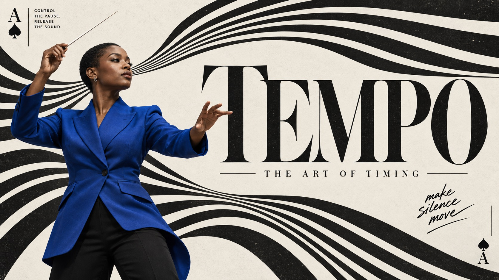

# Op Stripe Card Editorial



Playing-card editorial language meets optical black ink ribbons, monumental high-contrast serif type and a crisp colored photographic person on subtly textured light paper.

## Copy Prompt

Default case: `tempo`

```text
Use the "Op Stripe Card Editorial" visual style as the locked style.

Create a 16:9 image.

Subject: Fictional adult Black female orchestral conductor with close-cropped hair, cobalt-blue tailored jacket and black trousers, standing in an expressive three-quarter pose with one raised conducting baton and the other hand shaping the phrase; confident studio photograph
Action: [your a poised posture presented like a figure printed on a playing card]
Prop / product: [your the card index mark and the optical black ink ribbons framing the figure]
Location: [your a subtly textured light paper field with no real setting]
Background: [your optical black stripe ribbons, card corner indices and micro copy]
Main text: TEMPO
Secondary text: THE ART OF TIMING
Accent symbol: [your the card index symbol in the corner]
Styling: [your crisp contemporary clothing in one saturated color against the black ribbons]

Style direction:
Playing-card editorial language meets optical black ink ribbons, monumental high-contrast serif
type and a crisp colored photographic person on subtly textured light paper.

Keep visible:
- [CORE] Flowing black ink stripes alternate with light paper, bending, fanning or converging into a strong optical field that participates in the composition; flat graphic ribbons rather than glossy 3D tubes.
- [CORE] Monumental high-contrast display serif lettering and a crisp full-color photographic cutout share the main hierarchy against the nearly monochrome graphic field.
- [CORE] Playing-card-like rank/suit indexing and small editorial marginalia frame the design, mixing compact sans copy with expressive brush handwriting; typography remains readable.
- [FLEX] Stripe geometry may express gesture, air, force or structure. Its direction, negative space and relationship to the figure can change by case; a central spiral is not mandatory.
- [FLEX] Pose, crop, figure placement and headline shape are open design decisions guided by the theme. Choose a different spatial relationship per case without replicating the source seated silhouette.

Avoid:
No source face, source pose, source slogans, watermark, barcode, crown, two-of-clubs pair,
glossy 3D ribbons, fake distressed edges, unreadable headline, extra fingers, merged limbs or
unrelated props.

Do not copy source content, real logos, watermarks, platform UI, QR codes, or exact
reference layouts. Keep the visual system, but change the subject, text, and scene.
```

## Full Style

- [Open style.json](../../styles/op-stripe-card-editorial/style.json)
- [Open style folder](../../styles/op-stripe-card-editorial/)

<!-- Generated by scripts/generate-copy-prompts.py. Do not edit manually. -->
