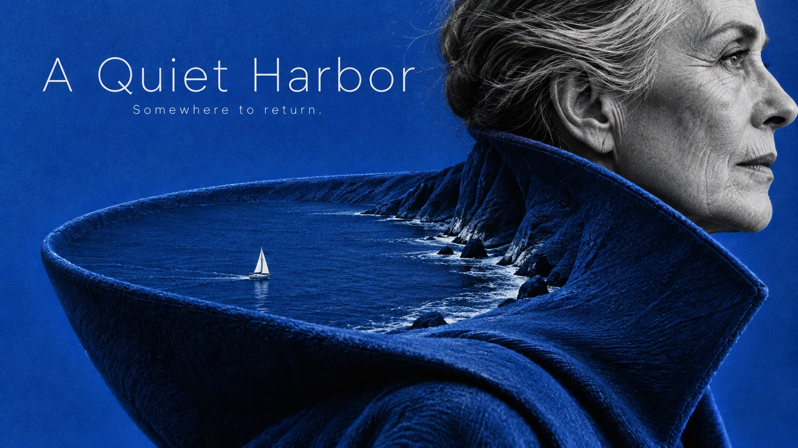

# Portrait as Terrain



Monochrome human fragments become monumental single-color landscapes inhabited by tiny figures.

## Copy Prompt

Default case: `quiet-harbor`

```text
Use the "Portrait as Terrain" visual style as the locked style.

Create a 16:9 image.

Subject: Black-white side profile of an invented older woman wearing a broad sculptural folded coat collar.
Action: [your How the human fragment becomes a landscape and hosts a tiny figure]
Prop / product: [your The transformed carrier that reads as terrain]
Location: [your Monumental single-color landscape field]
Background: [your Broad saturated negative space around the contour]
Main text: A Quiet Harbor
Secondary text: Somewhere to return.
Accent symbol: [your Tiny inhabitant of the terrain]
Styling: [your Photographic clothing, hair or body surface of the carrier]

Style direction:
Monochrome human fragments become monumental single-color landscapes inhabited by tiny figures.

Keep visible:
- [CORE] A high-contrast black-and-white photographic human fragment merges into one oversized tangible form that also reads as a landscape; both readings must be visible.
- [CORE] A tiny legible traveler or participant inhabits that landscape, creating a dramatic human-scale contradiction.
- [CORE] One saturated spot color dominates broad negative space and the transformed terrain, against deep black and paper-white portrait tones.
- [CORE] Spare editorial typography uses light or regular clean sans serif, with a large readable title and very small supporting line; typography leaves the visual metaphor clear.
- [FLEX] Choose crop, direction and placement from the story; face visibility is optional and the carrier may be body, garment or hair.

Avoid:
No cowboy hats, horses, film credits, logos, watermarks, extra words, collage boxes, multiple
spot colors, glossy 3D lettering, impossible fingers, disembodied extra limbs or generic double
exposure.

Do not copy source content, real logos, watermarks, platform UI, QR codes, or exact
reference layouts. Keep the visual system, but change the subject, text, and scene.
```

## Full Style

- [Open style.json](../../styles/portrait-as-terrain/style.json)
- [Open style folder](../../styles/portrait-as-terrain/)

<!-- Generated by scripts/generate-copy-prompts.py. Do not edit manually. -->
