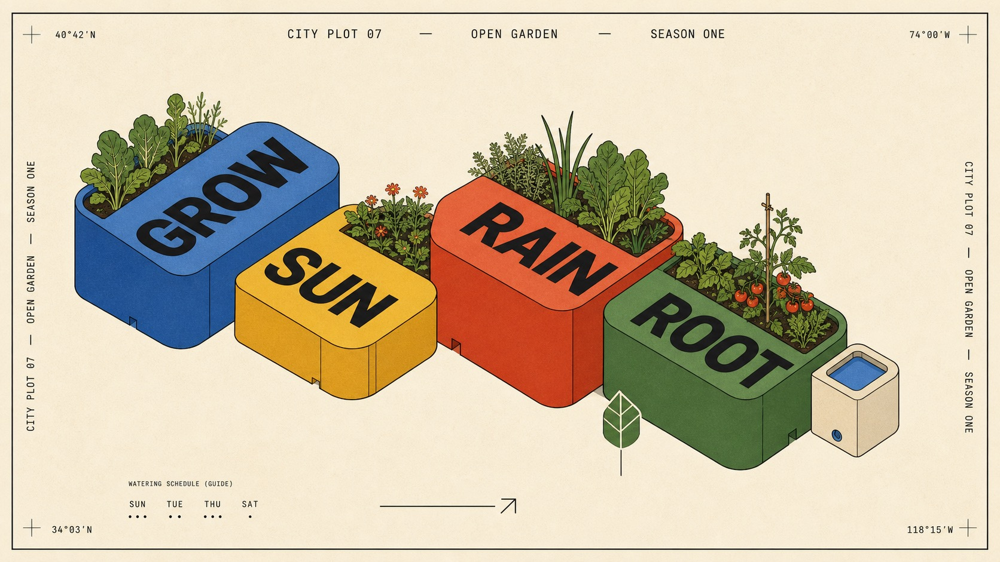

# Primary Block Isometric Editorial Poster Style



A crisp editorial poster system built from a sparse diagonal cluster of oversized rounded cuboids, oblique isometric depth, black hairline construction, bright primary-color top planes, darker side faces, oversized grotesk labels, and tiny Swiss-style perimeter copy on warm white paper.

## Copy Prompt

Default case: `rooftop-garden-modules`

```text
Use the "Primary Block Isometric Editorial Poster Style" visual style as the locked style.

Create a 16:9 image.

Subject: a family of abstract modular rooftop garden planters shaped as broad rounded architectural blocks
Action: stepping upward diagonally as a compact urban growing system
Prop / product: one small cream water reservoir block and a simple geometric leaf marker
Location: conceptual city-garden exhibition poster
Background: warm blank paper, one tiny watering schedule, a thin arrow, and sparse coordinate marks at the edges
Main text: GROW / SUN / RAIN / ROOT
Secondary text: CITY PLOT 07 — OPEN GARDEN — SEASON ONE
Accent symbol: ↗
Styling: smooth matte architectural card models with solid spot-color planes

Style direction:
A crisp editorial poster system built from a sparse diagonal cluster of oversized rounded
cuboids, oblique isometric depth, black hairline construction, bright primary-color top planes,
darker side faces, oversized grotesk labels, and tiny Swiss-style perimeter copy on warm white
paper.

Keep visible:
- Warm off-white editorial paper field with a thin black perimeter rule and generous clean margins
- Five to eight oversized rounded cuboids arranged as one loose diagonal stepped cluster
- Oblique isometric projection with a visible top plane and two extruded side planes on most forms
- Black hairline outlines, crisp vector-like edges, rounded top corners, and no photographic realism
- Cobalt blue, vermilion red-orange, grass green, cadmium yellow, and warm cream used as discrete solid color masses

Avoid:
computer keyboard, keyboard keycaps, escape key, flight poster, source wording, end-of-world
story, AI apocalypse copy, copied date, copied issue number, studio credit, website, logo,
watermark, username, QR code, brand mark, glossy 3D render, photoreal object, realistic room,
cinematic lighting, strong shadows, reflections, gradients, translucent plastic, chrome, complex
environment, dense collage, sticker bomb, grunge distress, neon glow, blurred typography,
misspelled main words, excessive text, borderless full bleed

Do not copy source content, real logos, watermarks, platform UI, QR codes, or exact
reference layouts. Keep the visual system, but change the subject, text, and scene.
```

## Full Style

- [Open style.json](../../styles/primary-block-isometric-editorial-poster-style/style.json)
- [Open style folder](../../styles/primary-block-isometric-editorial-poster-style/)

<!-- Generated by scripts/generate-copy-prompts.py. Do not edit manually. -->
