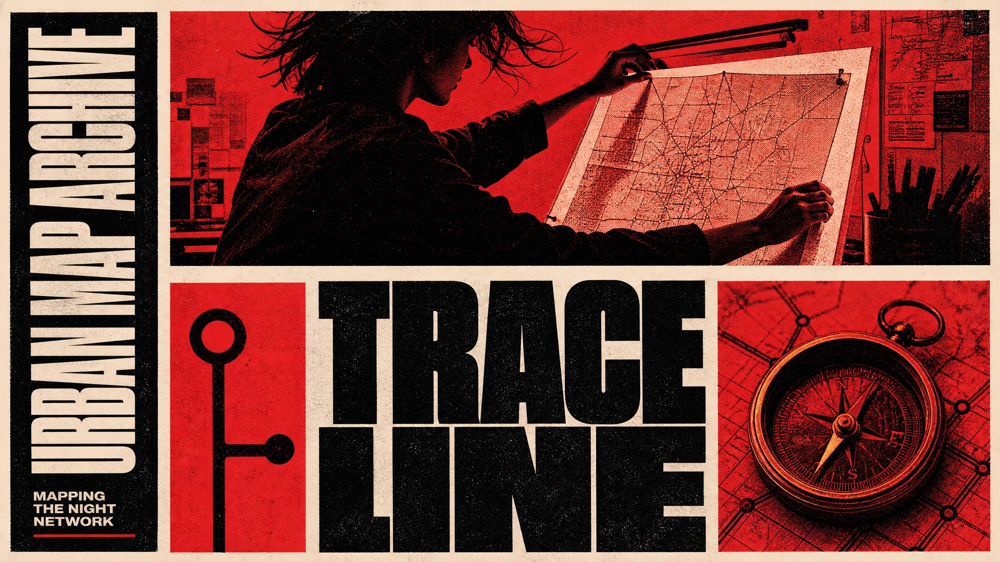

# Red Monochrome Editorial Grid



A confrontational editorial-poster system built from monumental condensed typography, red-and-black duotone photography, rigid off-white gutters, and paper-like ink grain. The design treats photographic crops and type blocks as equal grid modules rather than placing a single hero image behind type.

## Copy Prompt

Default case: `transit-cartographer`

```text
Use the "Red Monochrome Editorial Grid" visual style as the locked style.

Create a 16:9 image.

Subject: an anonymous urban cartographer with a close-cropped profile and wind-tossed hair
Action: pinning a folded transit map to a light table
Prop / product: a folded monochrome city-route map with a brass drawing compass
Location: a late shift in a municipal map archive
Background: faint gridlines, a desk lamp silhouette, stacked paper plans
Main text: TRACE
LINE
Secondary text: MAPPING THE NIGHT NETWORK
Accent symbol: SMALL ROUTE MARKER
Styling: black canvas work shirt with rolled sleeves

Style direction:
A confrontational editorial-poster system built from monumental condensed typography, red-and-
black duotone photography, rigid off-white gutters, and paper-like ink grain. The design treats
photographic crops and type blocks as equal grid modules rather than placing a single hero image
behind type.

Keep visible:
- Use a rigid modular poster grid separated by thick, imperfect off-white paper gutters that stay visible as structural lines.
- Treat the photo crops, black type fields, and red graphic fields as adjacent modules with hard rectangular boundaries.
- Use only ink-black, saturated signal red, and rough off-white paper, with no extra hue or smooth color gradient.
- Render photography as coarse high-contrast red-and-black duotone, with pronounced screenprint dots, xerox grain, and ink speckle.
- Crop subjects aggressively into fragments such as forehead, profile, shoulder, torso, object, or silhouette; do not make a conventionally centered beauty portrait.

Avoid:
No copied person, copied eyes, copied hand-to-face gesture, copied phrase, copied self-conflict
premise, copied grid positions, logo, watermark, QR code, brand name, full-color photography,
blue, green, purple, gradient, glossy product lighting, sleek UI, serif or script lettering,
thin type, 3D text, crowded microcopy, extra panels, distorted anatomy, or illegible text.

Do not copy source content, real logos, watermarks, platform UI, QR codes, or exact
reference layouts. Keep the visual system, but change the subject, text, and scene.
```

## Full Style

- [Open style.json](../../styles/red-monochrome-editorial-grid/style.json)
- [Open style folder](../../styles/red-monochrome-editorial-grid/)

<!-- Generated by scripts/generate-copy-prompts.py. Do not edit manually. -->
