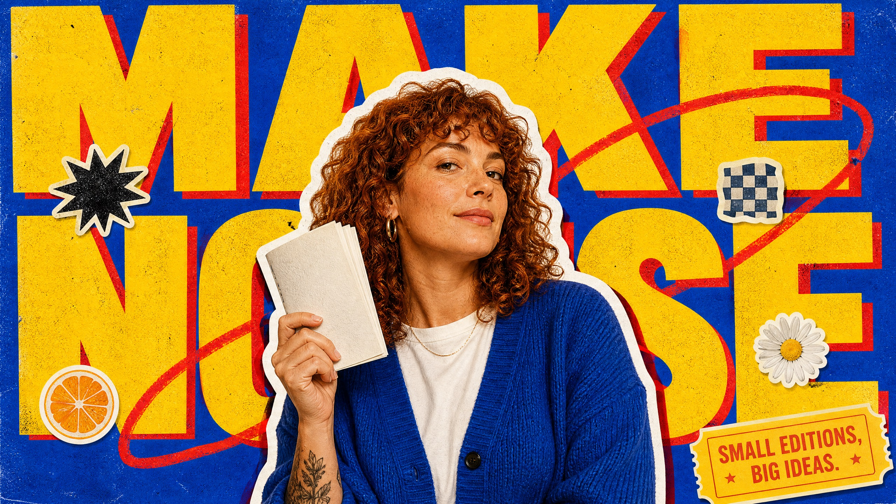

# Retro Pop Sticker Cutout



A loud retro-pop scrapbook poster system that layers an oversized yellow display headline, red offset print shadows, a central natural-color portrait cutout with a thick irregular white die-cut border, cobalt-blue paper texture, and small playful sticker marks. The result feels handmade, glossy-magazine inspired, and high-energy without copying any character, celebrity, or source design.

## Copy Prompt

Default case: `zine-maker`

```text
Use the "Retro Pop Sticker Cutout" visual style as the locked style.

Create a 16:9 image.

Subject: an adult zine maker with copper curly hair and a confident three-quarter gaze
Action: holding up a folded handmade mini-publication beside one shoulder
Prop / product: an unbranded stapled zine with abstract geometric cover art
Location: an implied independent print studio with no detailed scenery
Background: blue paper texture, yellow word blocks, red print offsets, small generic star and orange-slice stickers
Main text: MAKE
NOISE
Secondary text: SMALL EDITIONS, BIG IDEAS
Accent symbol: BLACK STARBURST
Styling: cobalt cardigan over a plain cream T-shirt, small silver earrings

Style direction:
A loud retro-pop scrapbook poster system that layers an oversized yellow display headline, red
offset print shadows, a central natural-color portrait cutout with a thick irregular white die-
cut border, cobalt-blue paper texture, and small playful sticker marks. The result feels
handmade, glossy-magazine inspired, and high-energy without copying any character, celebrity, or
source design.

Keep visible:
- Use a full-bleed saturated cobalt-blue paper background with visible fine grain, photocopy speckle, and lightly uneven ink texture.
- Set a huge two-word uppercase display headline in warm sunflower yellow, partially concealed behind the main portrait and cropped at the canvas edges.
- Add a misregistered scarlet-red duplicate shadow or offset behind selected yellow headline letterforms, producing a simple two-ink print effect.
- Use one large chest-up or waist-up photographic adult subject in the center or slightly off-center, treated as a paper cutout with an irregular thick white die-cut outline.
- Give the cutout a narrow dark drop shadow or red rim offset that makes it lift above the blue paper and headline layers.

Avoid:
No source woman's likeness, black retro bob, leopard jacket, cartoon bow, cat icon, candy swirl,
three-heart source sticker row, source headline, source handwritten credit, source barcode,
source signature, logo, watermark, username, QR code, branded sticker, protected character,
full-color background scene, muted palette, clean corporate style, gradient, glossy 3D, thin
typography, too many stickers, distorted face, malformed hands, or unreadable headline.

Do not copy source content, real logos, watermarks, platform UI, QR codes, or exact
reference layouts. Keep the visual system, but change the subject, text, and scene.
```

## Full Style

- [Open style.json](../../styles/retro-pop-sticker-cutout/style.json)
- [Open style folder](../../styles/retro-pop-sticker-cutout/)

<!-- Generated by scripts/generate-copy-prompts.py. Do not edit manually. -->
