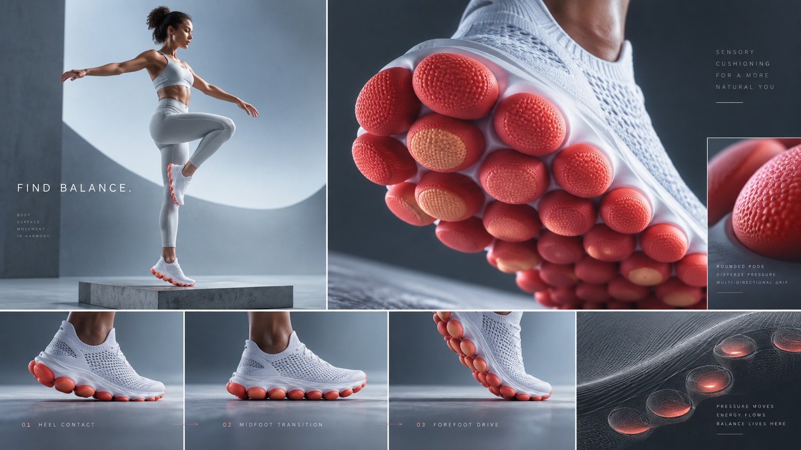

# Sensory Footwear Lab



Minimal future-sport product concepts pair tactile podded outsoles with quiet athletic gestures, modular editorial panels, ice-cool architecture and signal-coral accents.

## Copy Prompt

Default case: `find-balance`

```text
Use the "Sensory Footwear Lab" visual style as the locked style.

Create a 16:9 image.

Subject: An adult athlete holds a quiet one-leg balance pose on a low matte plinth; a second panel shows the same foot landing softly, the rounded tactile sole pods visibly aligned beneath it.
Action: [your Quiet athletic gesture that tests the tactile outsole]
Prop / product: White technical knit shoe with a signal-coral podded outsole and subtle peach pod tips
Location: [your Ice-cool modular architecture from the scene]
Background: [your Editorial panels, gutters and generous negative space]
Main text: FIND BALANCE
Secondary text: [your Small restrained technical labels]
Accent symbol: [your Signal-coral or magenta-red outsole accent]
Styling: [your Quiet athletic clothing that keeps the shoe dominant]

Style direction:
Minimal future-sport product concepts pair tactile podded outsoles with quiet athletic gestures,
modular editorial panels, ice-cool architecture and signal-coral accents.

Keep visible:
- [CORE] Present a conceptual performance shoe with a distinctive outsole made from repeated rounded tactile pods; the pod structure is the key product signature, while all branding remains blank.
- [CORE] Combine oversized product macro views with a human athletic gesture or still pose, suggesting a conversation between foot sensation and movement.
- [CORE] Use clean modular editorial panels or sharply separated light and dark image fields, with disciplined gutters, generous negative space and small restrained technical labels.
- [CORE] Limit color to cool ice white, blue-gray and deep graphite, punctuated by a strong signal-coral or magenta-red outsole accent and occasional warm pod tips.
- [CORE] Render product and people as polished, believable campaign photography with smooth studio gradients, precise material highlights and a restrained futuristic sports-lab mood.

Avoid:
No Nike, swoosh, Reebok, brand marks, legible tiny fake copy, watermark, copied source model or
exact collage, oversized decorative typography, cluttered HUD, glowing sci-fi circuits, extreme
neon, malformed feet or fingers, extra shoes, distorted pod geometry, low-resolution product
textures.

Do not copy source content, real logos, watermarks, platform UI, QR codes, or exact
reference layouts. Keep the visual system, but change the subject, text, and scene.
```

## Full Style

- [Open style.json](../../styles/sensory-footwear-lab/style.json)
- [Open style folder](../../styles/sensory-footwear-lab/)

<!-- Generated by scripts/generate-copy-prompts.py. Do not edit manually. -->
