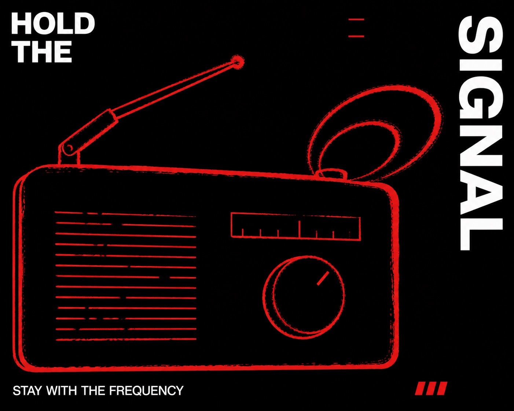

# Signal Red Contour Poster



A severe two-ink public-information poster system built from a near-black field, one monumental flat silhouette defined by an agitated signal-red contour, and detached white grotesk text arranged around the perimeter like urgent fragments.

## Copy Prompt

Default case: `static-siren`

```text
Use the "Signal Red Contour Poster" visual style as the locked style.

Create a 16:9 image.

Subject: an oversized tabletop emergency radio reduced to a blocky icon-like mass
Action: emitting two compressed signal-wave loops from one corner
Prop / product: a single bent antenna integrated into the silhouette
Location: an abstract overnight broadcast zone with no visible room
Background: only two short red frequency ticks and otherwise empty black space
Main text: HOLD / THE / SIGNAL
Secondary text: STAY WITH THE FREQUENCY
Accent symbol: three tiny offset red bars
Styling: matte black industrial casing with no visible branding

Style direction:
A severe two-ink public-information poster system built from a near-black field, one monumental
flat silhouette defined by an agitated signal-red contour, and detached white grotesk text
arranged around the perimeter like urgent fragments.

Keep visible:
- Use an almost pure black ground occupying roughly eighty-five percent of the image, with no pictorial background scene.
- Build the composition around one huge black-filled silhouette that nearly disappears into the ground and is revealed by a vivid signal-red perimeter contour.
- Make the red contour uneven, scraped, dry-brush, and slightly broken, with variable thickness and occasional edge chatter.
- Keep the image resolutely flat and poster-like, without modeled volume, spatial depth, perspective scenery, or cast shadows.
- Arrange large white neo-grotesk uppercase text as detached fragments around the outer margins rather than as a conventional centered headline.

Avoid:
Photorealism, photographic backgrounds, 3D render, volumetric light, gradients, glow, shadows,
modeled anatomy, realistic skin, perspective scenery, multiple subjects, crowded objects,
collage, halftone photo, paper mockup, decorative frame, sticker pack, large red fills, extra
colors, serif type, script type, playful rounded fonts, distressed white type, centered
conventional headline, tobacco, cigarette, cigar, pipe, smoke cloud, smoking gesture, copied
German warning text, copied human silhouette, signature, artist credit, logo, watermark,
username, QR code, platform mark.

Do not copy source content, real logos, watermarks, platform UI, QR codes, or exact
reference layouts. Keep the visual system, but change the subject, text, and scene.
```

## Full Style

- [Open style.json](../../styles/signal-red-contour-poster/style.json)
- [Open style folder](../../styles/signal-red-contour-poster/)

<!-- Generated by scripts/generate-copy-prompts.py. Do not edit manually. -->
