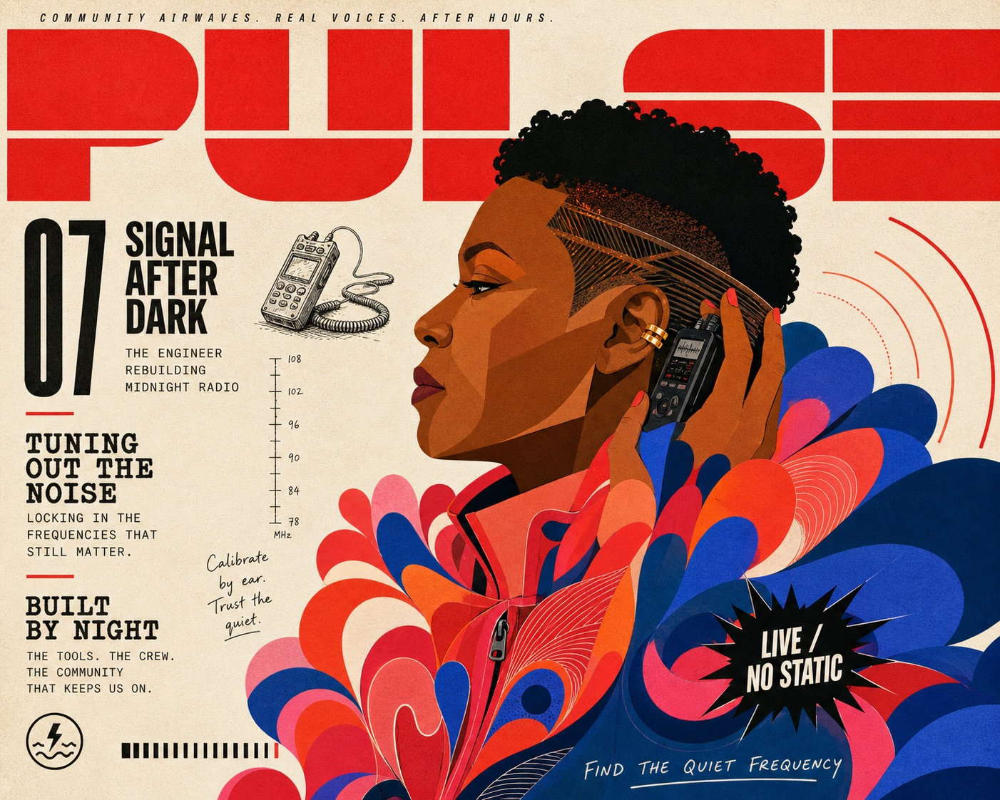

# Signal Red Petal Profile Editorial Cover



A maximal independent-magazine cover system built from a fragmented signal-red masthead, one monumental flat-color side-profile portrait, a sparse off-white editorial rail, and a huge right-heavy mantle of overlapping cobalt, coral, and hot-pink petal lobes. Multiple typographic voices, a single black burst, tiny drawn ephemera, and restrained uncoated-paper texture create a cheeky fashion-editorial rhythm without copying any real publication or person.

## Copy Prompt

Default case: `signal-after-dark`

```text
Use the "Signal Red Petal Profile Editorial Cover" visual style as the locked style.

Create a 16:9 image.

Subject: a middle-aged Black woman radio engineer with a shaved temple and one gold ear cuff, shown in strict left-facing profile
Action: holding a compact field recorder near her ear as if isolating a hidden frequency
Prop / product: a tiny black pen-and-ink field recorder with one coiled cable
Location: an abstract late-night community broadcast studio expressed only through two signal arcs
Background: two simplified radio-wave arcs, a tiny frequency scale, and one narrow calibration note
Main text: MASTHEAD: PULSE; FEATURE: SIGNAL AFTER DARK
Secondary text: DECK: THE ENGINEER REBUILDING MIDNIGHT RADIO; BURST: LIVE / NO STATIC; ISSUE: 07; FOOTER: FIND THE QUIET FREQUENCY
Accent symbol: a fictional lightning-wave emblem inside a small shieldless circle
Styling: a coral work jacket with a monumental cobalt and hot-pink waveform-lobe collar; abstract audio ribbons, never feathers

Style direction:
A maximal independent-magazine cover system built from a fragmented signal-red masthead, one
monumental flat-color side-profile portrait, a sparse off-white editorial rail, and a huge
right-heavy mantle of overlapping cobalt, coral, and hot-pink petal lobes. Multiple typographic
voices, a single black burst, tiny drawn ephemera, and restrained uncoated-paper texture create
a cheeky fashion-editorial rhythm without copying any real publication or person.

Keep visible:
- A warm off-white uncoated-paper field supports an asymmetric independent-magazine cover rather than a centered poster or clean card layout.
- A giant signal-red geometric masthead spans at least ninety percent of the top width, occupies roughly eighteen to twenty-two percent of the height, is cropped by the frame, and is split by one or two white horizontal cuts.
- One monumental strict side-profile figure occupies the center-right and extends beyond the right and bottom edges; the head sits near the upper-middle rather than the center.
- A narrow exposed-paper editorial rail occupies roughly one quarter to one third of the left side and carries several irregularly stacked text clusters rather than boxed modules.
- The entire portrait is built from crisp flat vector or cut-paper color planes with no photoreal skin, modeled shading, cast shadows, glossy light, or universal black outline.

Avoid:
recognizable athlete, celebrity likeness, football, soccer, stadium, Norway flag, sports crest,
real magazine logo, copied source headline, source number 9, matching blond crown and dark bun,
matching angular sunglasses, literal feather boa, identical costume, centered portrait, full
contained body, symmetrical grid, boxed sidebar, equal cards, multiple people, photorealistic
skin, photographic collage, painterly portrait, anime, superhero comic, universal black outline,
glossy 3D, airbrush, gradient modeling, drop shadow, realistic feathers, flower bouquet, pastel
palette, rainbow drift, excessive empty space, heavy grunge, torn paper, photocopy distress,
muddy halftone, illegible pseudo-text, sticker wall, watermark, username, platform logo, QR
code, real barcode, signature

Do not copy source content, real logos, watermarks, platform UI, QR codes, or exact
reference layouts. Keep the visual system, but change the subject, text, and scene.
```

## Full Style

- [Open style.json](../../styles/signal-red-petal-profile-editorial-cover/style.json)
- [Open style folder](../../styles/signal-red-petal-profile-editorial-cover/)

<!-- Generated by scripts/generate-copy-prompts.py. Do not edit manually. -->
