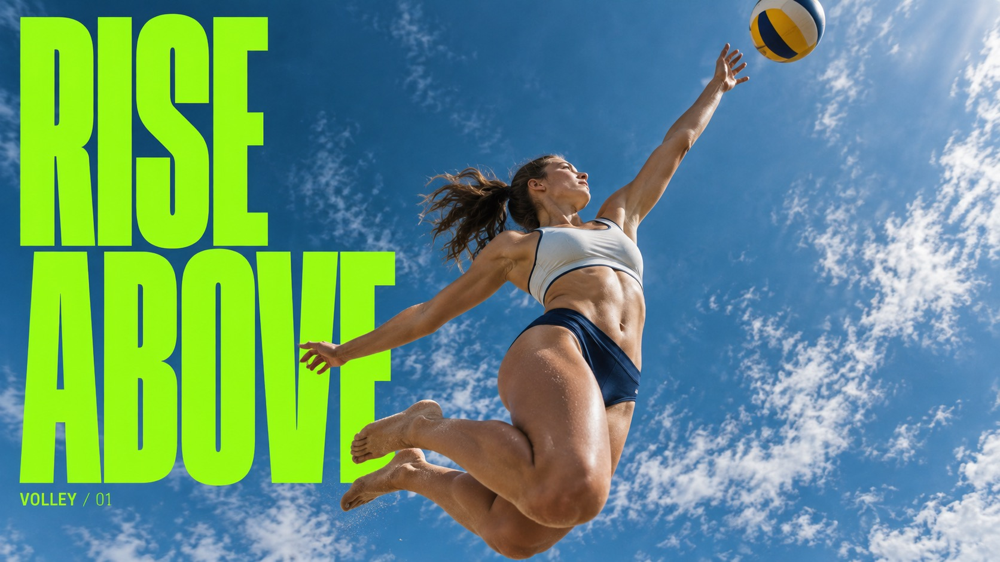

# Skyward Condensed Action



Worm-eye airborne sports photography against expansive cool blue sky, with monumental ultra-condensed fluorescent uppercase type occluded by a sharply foreshortened human silhouette.

## Copy Prompt

Default case: `volley-reach`

```text
Use the "Skyward Condensed Action" visual style as the locked style.

Create a 16:9 image.

Subject: An adult female beach volleyball athlete in plain ivory and navy kit, jumping for a one-handed spike. Camera directly below and slightly ahead: raised right palm close below a single volleyball, torso twisting, other arm counterbalances and both knees bend behind her. Blue sky and delicate clouds only; no court or net required. Hands and ball separate with a small air gap.
Action: [your an airborne athletic movement seen from directly below at its apex]
Prop / product: [your the sport implement carried through the airborne moment]
Location: [your expansive cool blue open sky with almost no ground visible]
Background: [your uninterrupted sky and the monumental fluorescent type partly occluded by the figure]
Main text: RISE ABOVE
Secondary text: [your the compact supporting label sitting near the headline]
Accent symbol: [your the fluorescent color accent carried by the condensed type]
Styling: [your athletic kit that silhouettes cleanly against bright sky]

Style direction:
Worm-eye airborne sports photography against expansive cool blue sky, with monumental ultra-
condensed fluorescent uppercase type occluded by a sharply foreshortened human silhouette.

Keep visible:
- [CORE] Monumental EXTRA-BOLD ULTRA-CONDENSED upright uppercase sans lettering forms a dense graphic wall behind the photographic figure; very tall narrow glyphs with narrow counters, not wide geometric or lean italic lettering.
- [CORE] Dramatic camera from below captures a believable airborne adult and near/far foreshortening against an expansive cool cyan-to-petrol blue sky with fine white clouds; one connected figure, natural body proportions under perspective.
- [CORE] One flat electric lime-green ink makes the headline and tiny supporting text; skin, pale neutral and deep navy clothing remain photographic. The figure overlaps part of the headline while its full wording stays inferable.
- [FLEX] Airborne gesture and object relationships follow the activity: reaching, folding, rotating or clearing an obstacle. Do not reuse the source high kick.
- [FLEX] Arrange the towering condensed headline around the action and integrate it through readable silhouette overlap. Choose line breaks and placement by subject shape; avoid a detached text column or two text walls squeezing the figure.

Avoid:
No Nike swoosh, logos, team marks, watermark, celebrity identity, football uniform, extra
people, extra limbs, detached hands, illegible title, starbursts, text boxes, wide fonts, italic
lettering, distressed paper.

Do not copy source content, real logos, watermarks, platform UI, QR codes, or exact
reference layouts. Keep the visual system, but change the subject, text, and scene.
```

## Full Style

- [Open style.json](../../styles/skyward-condensed-action/style.json)
- [Open style folder](../../styles/skyward-condensed-action/)

<!-- Generated by scripts/generate-copy-prompts.py. Do not edit manually. -->
