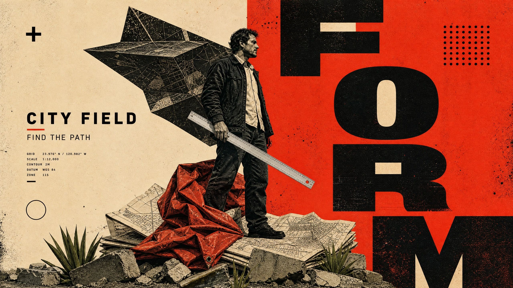

# Split Ink Monumental Editorial



A high-contrast editorial-collage system built from a strict warm-cream and vermilion split field, enormous cropped black letter architecture, a central monochrome full-body subject, and tactile foreground forms. A crumpled red material and an angular dark backdrop provide diagonal drama while microtype, dot grids, and distressed ink create a dense screenprinted poster surface.

## Copy Prompt

Default case: `map-maker`

```text
Use the "Split Ink Monumental Editorial" visual style as the locked style.

Create a 16:9 image.

Subject: an adult urban map maker with short braided hair in reduced-color collage treatment
Action: standing on a stack of folded city plans while measuring a route with a long survey ruler
Prop / product: a plain aluminum survey ruler and folded unbranded paper map
Location: an abstract public-planning archive with no identifiable city
Background: warm-cream/vermilion split field, large black FORM type slabs, angular dark folded map canopy, crumpled red survey tarp, agave leaves and concrete fragments at base
Main text: FORM
Secondary text: CITY FIELD / FIND THE PATH
Accent symbol: PLUS AND HOLLOW RING
Styling: dark canvas jacket, cream work shirt, black practical shoes, no armor or cape

Style direction:
A high-contrast editorial-collage system built from a strict warm-cream and vermilion split
field, enormous cropped black letter architecture, a central monochrome full-body subject, and
tactile foreground forms. A crumpled red material and an angular dark backdrop provide diagonal
drama while microtype, dot grids, and distressed ink create a dense screenprinted poster
surface.

Keep visible:
- Divide the main field into a hard-edged warm-cream block and a saturated vermilion block, with an intentional vertical or near-vertical seam acting as a primary compositional axis.
- Use monumental near-black uppercase geometric sans-serif letters as cropped vertical architectural slabs behind and around the subject, not as a small headline above the scene.
- Let the oversized type alternate between solid black strokes and cream counter-shapes cut out from the vermilion field, so the type becomes part of the background structure.
- Place one full-body adult subject in a high-contrast monochrome or reduced-color collage treatment, bridging the seam and overlapping the letter architecture.
- Use a large angular dark folded fabric, canopy, paper sculpture, or industrial tarp behind the subject as a single diagonal silhouette; do not use feathered wings or a character-like body extension.

Avoid:
No winged warrior, no sword, no armor, no feathered wing, no red cape, no reptile, no crocodile,
no monster head, no teeth, no scales, no fantasy battle, no source phrase, no source glyphs, no
copied central pose, no source dot position, no franchise name, no logo, no watermark, no
username, no ornate fantasy letters, no glossy 3D rendering, no cinematic rainbow color, no
blue/cyan/violet/neon/gold, no extra badges, no distorted anatomy, and no unreadable headline.

Do not copy source content, real logos, watermarks, platform UI, QR codes, or exact
reference layouts. Keep the visual system, but change the subject, text, and scene.
```

## Full Style

- [Open style.json](../../styles/split-ink-monumental-editorial/style.json)
- [Open style folder](../../styles/split-ink-monumental-editorial/)

<!-- Generated by scripts/generate-copy-prompts.py. Do not edit manually. -->
