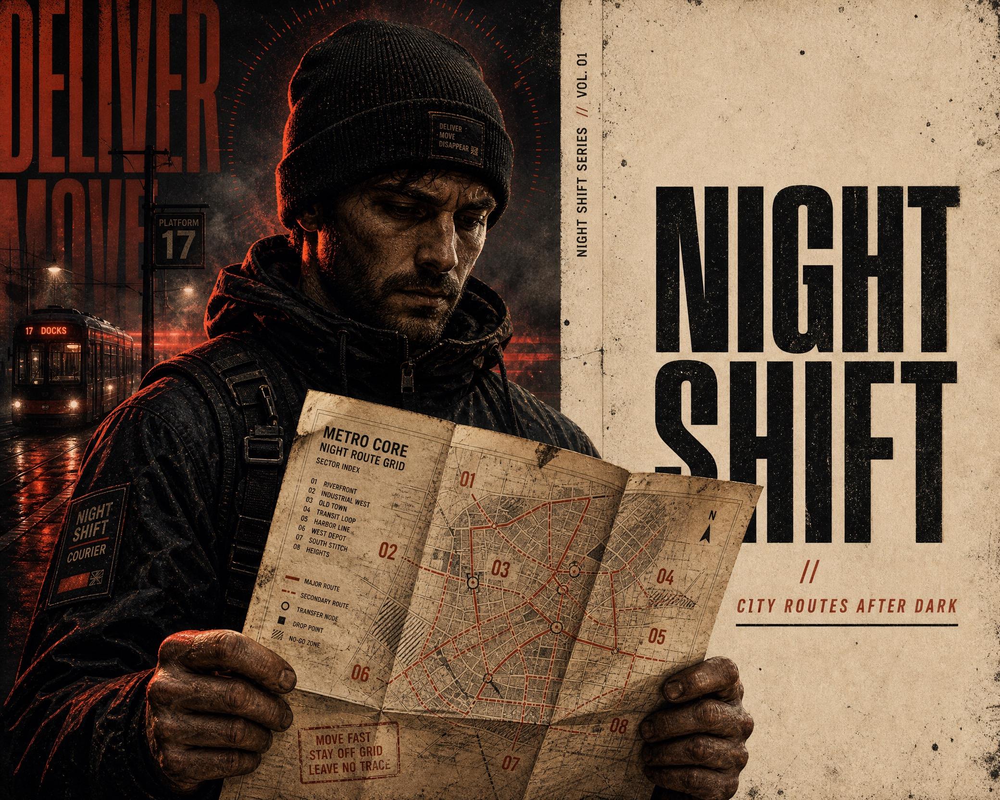

# Split Scorched Editorial Poster



A high-contrast editorial campaign-poster system built from three interacting depth planes: a shadowed atmosphere, a monumental cropped hero, and one oversized foreground object that breaks the dark-versus-paper seam. The visual tension comes from that object intruding into the otherwise quiet warm-paper information field.

## Copy Prompt

Default case: `night-courier`

```text
Use the "Split Scorched Editorial Poster" visual style as the locked style.

Create a 16:9 image.

Subject: a nocturnal bicycle courier with a weathered, focused expression
Action: holding an unfolded waterproof route chart close to the chest
Prop / product: a creased analog city route chart with a small brass clip
Location: an empty tram platform after rain
Background: blurred rail wires, wet concrete reflections, one distant amber signal
Main text: NIGHT
SHIFT
Secondary text: CITY ROUTES AFTER DARK
Accent symbol: DOUBLE SLASH
Styling: dark waxed canvas jacket, red knit collar, reflective messenger strap

Style direction:
A high-contrast editorial campaign-poster system built from three interacting depth planes: a
shadowed atmosphere, a monumental cropped hero, and one oversized foreground object that breaks
the dark-versus-paper seam. The visual tension comes from that object intruding into the
otherwise quiet warm-paper information field.

Keep visible:
- A near-even vertical split establishes a dark saturated image field on the left and an aged warm-paper field on the right, but the split is interrupted by the foreground object.
- The left image field is a deep atmospheric stage with smoky charcoal depth, lateral scarlet haze, and faint horizontal motion or scan streaks behind the subject.
- The hero is a monumental upper-body figure located in the middle depth plane: head in the upper-left quadrant, shoulders and torso receding downward, and the body cropped hard by the left and lower edges.
- The hero is not isolated against a blank backdrop; a faint echo silhouette, glow halo, or doubled contour sits behind and around the head to merge figure and atmosphere.
- Hard molten scarlet-orange rim light cuts the hero and creates a warm underlight on the neck, hands, and upper chest against crushed charcoal shadows.

Avoid:
No football, helmet, faceguard, shoulder pads, ball, glove, sports league mark, team identity,
jersey number, athlete likeness, stadium, matchup copy, copied date or venue, watermark,
signature, QR code, platform logo, bright blue, green, pastel palette, glossy 3D, clean
corporate ad, crowded scene, duplicate people, distorted hands, unreadable text, accidental
digital noise, muddy dithering, or compression artifacts.

Do not copy source content, real logos, watermarks, platform UI, QR codes, or exact
reference layouts. Keep the visual system, but change the subject, text, and scene.
```

## Full Style

- [Open style.json](../../styles/split-scorched-editorial-poster/style.json)
- [Open style folder](../../styles/split-scorched-editorial-poster/)

<!-- Generated by scripts/generate-copy-prompts.py. Do not edit manually. -->
