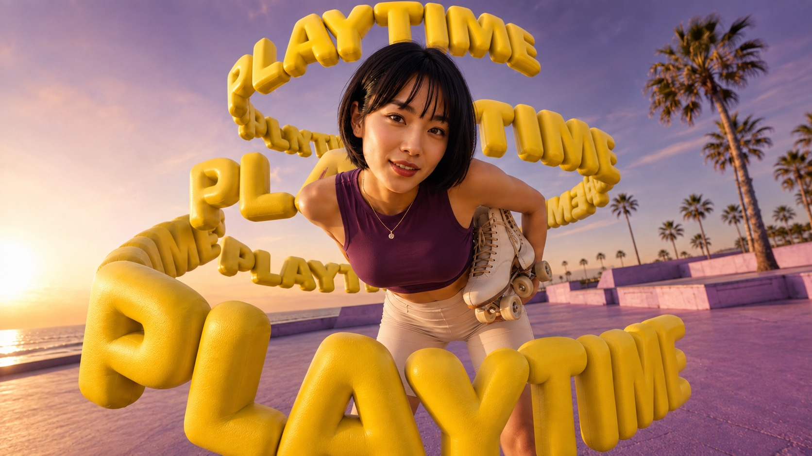

# Sculptural Type Helix — Refined



Refinement of the existing four helix portraits: retain subjects, props, palette and material families; improve close camera impact, letter hierarchy and scene integration without introducing new concepts.

## Copy Prompt

Default case: `roller-day`

```text
Use the "Sculptural Type Helix — Refined" visual style as the locked style.

Create a 16:9 image.

Subject: an adult East Asian woman with a short black bob
Action: [your Pose and single salient handheld prop]
Prop / product: [your one salient handheld prop]
Location: a lavender seaside skate plaza with pale concrete and sparse distant palms at late afternoon
Background: [your secondary scene details that support the location]
Main text: PLAYTIME
Secondary text: [your optional supporting text; leave unused if not needed]
Accent symbol: [your optional decorative mark; leave unused if not needed]
Styling: [your Clothing supporting the case-specific art direction]

Style direction:
Refinement of the existing four helix portraits: retain subjects, props, palette and material
families; improve close camera impact, letter hierarchy and scene integration without
introducing new concepts.

Keep visible:
- [CORE] Oversized three-dimensional letters form a continuous descending helix of approximately three turns around one person, visibly passing behind the shoulders and in front of the torso.
- [CORE] Strong near/far scale contrast makes the lower foreground lettering dramatically larger than the distant upper arch.
- [CORE] Close wide-angle perspective exaggerates the face and foreground and compresses the distant body and environment.
- [CORE] Keep the face unobstructed, framed by the upper arch; coherent occlusion and scene lighting integrate the letters into the physical space.
- [FLEX] Palette, sculptural letter material, uppercase typeface personality and light mood follow each case art direction; retain thick readable letter volumes and subject/type separation.

Avoid:
Watermarks, logos, SUMMERTIME, basketball, original face, flat overlay lettering, disconnected
rings, separate support rails, lettering covering eyes, misspelled front-facing words, malformed
anatomy, default orange-blue-green styling.

Do not copy source content, real logos, watermarks, platform UI, QR codes, or exact
reference layouts. Keep the visual system, but change the subject, text, and scene.
```

## Full Style

- [Open style.json](../../styles/tangerine-type-helix-fisheye/style.json)
- [Open style folder](../../styles/tangerine-type-helix-fisheye/)

<!-- Generated by scripts/generate-copy-prompts.py. Do not edit manually. -->
