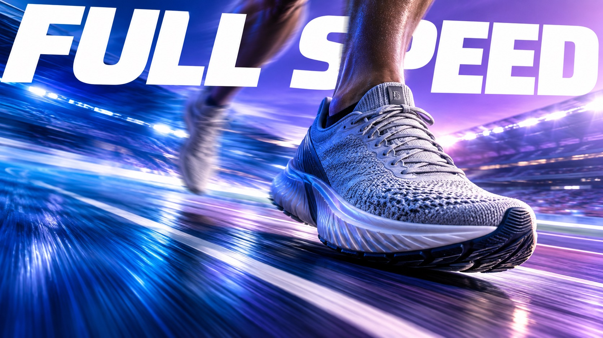

# Visual OS 051 — Freeze the Gear



Full-bleed future-sport posters isolate one razor-sharp piece of gear against directional motion trails, luminous gradients and a single giant white geometric slogan.

## Copy Prompt

Default case: `full-speed`

```text
Use the "Visual OS 051 — Freeze the Gear" visual style as the locked style.

Create a 16:9 image.

Subject: [your One sharply frozen sport object that carries the concept]
Action: [your Directional speed that streaks everything except the frozen gear]
Prop / product: [your The razor-sharp piece of gear used as the visual anchor]
Location: [your Luminous saturated gradient field with a clear light sweep]
Background: [your People, surfaces and lights stretched into motion trails]
Main text: FULL SPEED
Secondary text: [your No extra copy beyond the giant slogan]
Accent symbol: [your Giant white geometric uppercase slogan as a compositional shape]
Styling: [your Blurred supporting athletes or kit that never rival the frozen gear]

Style direction:
Full-bleed future-sport posters isolate one razor-sharp piece of gear against directional motion
trails, luminous gradients and a single giant white geometric slogan.

Keep visible:
- [CORE] Make one sport object razor-sharp and freeze it as the only stable visual anchor; all supporting action, people, surfaces and lights streak with directional motion blur.
- [CORE] Use a luminous saturated gradient field with a clear directional light sweep, rich color separation and a softly photographic sports-campaign finish.
- [CORE] Set one giant white geometric sans-serif slogan in uppercase, cropped or angled through the frame as an active compositional shape; keep all other copy absent or microscopic.
- [CORE] Compose full-bleed edge-to-edge posters with an oversized foreground object, aggressive perspective and a readable path of motion from one side of the frame to the other.
- [CORE] Preserve tactile material realism on the frozen anchor: rubber, leather, textile, metal, wood or composite surfaces must remain crisp while the surrounding world smears.

Avoid:
No logos, brand names, swooshes, watermarks, copied athlete likeness, copied reference layout,
duplicate anchor objects, blurred hero object, multiple equally sharp objects, malformed
anatomy, extra limbs, flat studio background, muted catalog look, muddy blur, noisy grain, fake
UI, tiny paragraphs, illegible slogan, misspelled title, low resolution.

Do not copy source content, real logos, watermarks, platform UI, QR codes, or exact
reference layouts. Keep the visual system, but change the subject, text, and scene.
```

## Full Style

- [Open style.json](../../styles/vector-atelier/style.json)
- [Open style folder](../../styles/vector-atelier/)

<!-- Generated by scripts/generate-copy-prompts.py. Do not edit manually. -->
