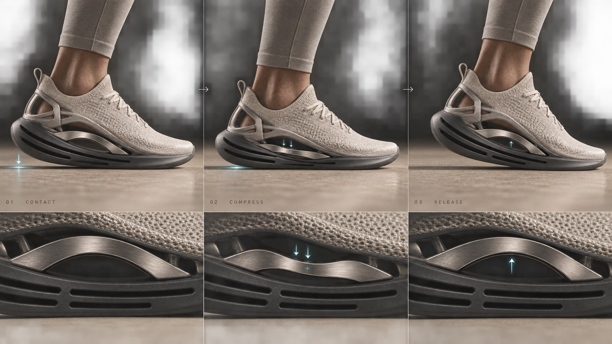

# Vector Process Study



Premium footwear process boards explain load, flex, fit and construction through sequential image panels, tactile material macros, sparse micro-labels and a distinct sculptural shoe architecture.

## Copy Prompt

Default case: `impact-damping`

```text
Use the "Vector Process Study" visual style as the locked style.

Create a 16:9 image.

Subject: A shoe meets the floor heel-first; a matching cutaway shows the open titanium arch flexing slightly under load; the final stage shows the bridge returning to neutral. Include only three minimal process states.
Action: [your Physical change visible between sequential process stages]
Prop / product: Pearl-bone knit trainer with an open titanium arch that flexes under heel load
Location: [your Premium material setting for the process board]
Background: [your Panel sequence, cross-sections and studio contact shadows]
Main text: 01 CONTACT · 02 COMPRESS · 03 RELEASE
Secondary text: [your Tiny process numbers and short stage labels]
Accent symbol: [your Understated arrows marking the functional change]
Styling: [your Any human gesture kept secondary to the shoe process]

Style direction:
Premium footwear process boards explain load, flex, fit and construction through sequential
image panels, tactile material macros, sparse micro-labels and a distinct sculptural shoe
architecture.

Keep visible:
- [CORE] Tell one clear product process from left to right or top to bottom using three or four sequential panels; physical change between stages must be visible.
- [CORE] Use a distinct unbranded trainer: pearl-bone knit upper, open heel cage, brushed-titanium floating arch bridge, one continuous smoked-ceramic rocker with three long carved channels and a smooth integrated forefoot.
- [CORE] Make the process legible with side views, cross-sections, material macros, understated arrows and consistent stage spacing; prioritize explanation over a heroic portrait.
- [CORE] Premium material realism: individual knit fibers, brushed titanium grain, satin ceramic, soft stone and accurate contact shadows under sculptural studio light.
- [CORE] Keep typography exceptionally sparse and small: only hairline step numbers and short process labels, aligned to panel edges; no large display title or decorative headline.

Avoid:
No large typography, oversized headline, decorative slogan, dense paragraphs, copied source
shoe, repeated circular pods, bright-red outsole, logos, swooshes, trademarks, exact reference
collage, giant athlete portrait, crowded HUD, glowing sci-fi circuits, loud neon, malformed
anatomy, duplicate shoes, unreadable process order, inaccurate cutaway, plasticky knit, low-
resolution texture.

Do not copy source content, real logos, watermarks, platform UI, QR codes, or exact
reference layouts. Keep the visual system, but change the subject, text, and scene.
```

## Full Style

- [Open style.json](../../styles/vector-process-study/style.json)
- [Open style folder](../../styles/vector-process-study/)

<!-- Generated by scripts/generate-copy-prompts.py. Do not edit manually. -->
