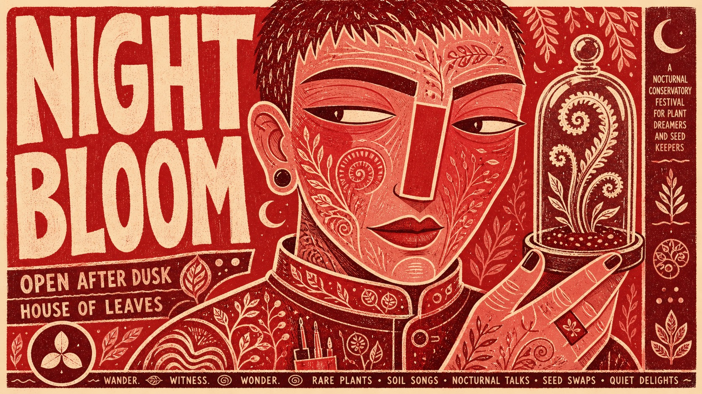

# Vermilion Folk Screenprint Character Poster



A hand-pulled theatrical poster system built around one monumental front-facing character, a warm uncoated paper field, a tightly limited vermilion-to-rose ink family, carved folk-pattern fills, and hand-lettered display type that behaves as part of the illustration.

## Copy Prompt

Default case: `midnight-botanist`

```text
Use the "Vermilion Folk Screenprint Character Poster" visual style as the locked style.

Create a 16:9 image.

Subject: an androgynous midnight botanist with a broad angular face and cropped hair
Action: holding a calm, knowing sideways glance while presenting a rare seedling
Prop / product: a small glass cloche containing a curling fern
Location: an imaginary nocturnal conservatory festival
Background: flat leaf silhouettes, seed spirals, two tiny crescent emblems, and narrow paper gaps
Main text: NIGHT BLOOM
Secondary text: OPEN AFTER DUSK / HOUSE OF LEAVES
Accent symbol: a three-petal seed emblem
Styling: a high-collared work smock filled with carved vine, seed, and wave motifs

Style direction:
A hand-pulled theatrical poster system built around one monumental front-facing character, a
warm uncoated paper field, a tightly limited vermilion-to-rose ink family, carved folk-pattern
fills, and hand-lettered display type that behaves as part of the illustration.

Keep visible:
- One oversized front-facing bust dominates the frame, cropped firmly at the lower torso and nearly touching multiple edges.
- The face is flattened into broad interlocking shapes with a long geometric nose, heavy horizontal eyelids, and intentionally lopsided hand-drawn contours.
- A strict warm palette uses unprinted cream paper plus vermilion, scarlet, brick red, dusty rose, burgundy, and only tiny near-black accents.
- Dense hand-carved folk motifs fill skin, hair, clothing, and props while leaving the cream paper visible as the line color.
- Display lettering is chunky, rounded, irregular, vertically stacked or edge-hugging, and treated as an illustrated shape rather than typeset copy.

Avoid:
Photorealism, realistic skin, photography, 3D render, cinematic depth, perspective background,
depth of field, gradients, glossy light, cast shadows, cool colors, blue, green, rainbow
palette, polished corporate vector art, precise symmetry, modern sans-serif typesetting, generic
AI fantasy art, anime, clean comic line art, watercolor, oil paint, excessive grunge, heavy
compression, random glyphs, illegible pseudo-text, watermark, username, QR code, logo,
signature, creator mark, copied theatre branding, crown, monarch, royal beard, Shakespeare,
Macbeth, Globe theatre, source wording, source dates, source ticket copy.

Do not copy source content, real logos, watermarks, platform UI, QR codes, or exact
reference layouts. Keep the visual system, but change the subject, text, and scene.
```

## Full Style

- [Open style.json](../../styles/vermilion-folk-screenprint-character-poster/style.json)
- [Open style folder](../../styles/vermilion-folk-screenprint-character-poster/)

<!-- Generated by scripts/generate-copy-prompts.py. Do not edit manually. -->
